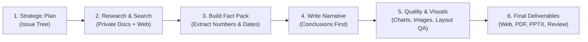

# How Reports Are Generated in gen_rpt (In Simple Words)

> A clear, easy-to-understand explanation of how the AI Deep Research Report Generator turns a simple idea into an executive-ready consulting report.

---

## 🌟 The Big Picture (In 10 Seconds)

Imagine hiring an entire team of top management consultants, research analysts, fact-checkers, graphic designers, and executive editors. 

When you give them a topic like **"The Future of Commercial Electric Aircraft by 2035"**, they don't just write a quick summary—they:
1. Break down the business problem.
2. Search the web and read private company documents.
3. Extract real numbers, dates, and official sources.
4. Write a deep, structured analysis.
5. Create branded charts and cover art.
6. Inspect the PDF layout to ensure zero formatting errors.
7. Deliver a **Web Page, PDF Report, and PowerPoint Deck** ready for the CEO.

**`gen_rpt` does all of this automatically in just a few minutes.**

---

## 🧩 The 6 Simple Stages of Report Generation

---

### 1. Stage 1: Breaking Down the Topic (The Strategic Plan)
When you type a research topic into the system:
- The AI **does not** immediately start writing paragraphs.
- Instead, it acts like a strategic consultant using the **Issue Tree** method.
- It breaks down your topic into 4 to 6 crucial sub-questions:
  - *What is the current market size and growth forecast?*
  - *What are the major technological and battery bottlenecks?*
  - *What regulations and government policies apply?*
  - *Who are the leading companies and competitive players?*
  - *What are the key financial risks and investment requirements?*

---

### 2. Stage 2: Gathering the Facts (Private Files + Public Web Search)
To answer each question, the system gathers real information from two sources:
- **Your Private Files (RAG)**: If you uploaded company documents, PDFs, or spreadsheets, the AI searches your private knowledge database first using smart vector search.
- **Live Web & Academic Search**: For public data, it searches the live internet (via SearXNG, DuckDuckGo, Bing) and academic paper databases (like OpenAlex) to find the latest news, regulatory filings, and market statistics.
- It downloads and reads the actual pages and PDFs.

---

### 3. Stage 3: Building the "Fact Pack" (Evidence Ledger)
Before writing any sentences, the system creates an evidence database called the **Fact Pack**:
- It pulls out **exact numbers** (e.g., *"$4.2 billion"*, *"35% CAGR"*, *"500 Wh/kg"*).
- It records **exact dates and timelines** (e.g., *"Q3 2027 certification"*).
- It links every fact directly to its **authoritative source domain** (e.g., FAA, SEC filings, Bloomberg, academic papers).
- **Rule**: If a fact cannot be proven by a real source, the AI is not allowed to use it.

---

### 4. Stage 4: Writing the Report (The Pyramid Principle)
Now the AI writes the complete research report following the **Pyramid Principle** (used by top consulting firms):
- **Conclusion First**: Every section starts with a sharp, bold takeaway so executive readers get the main point immediately.
- **Deep Exploration**: Each section includes at least 3 thorough paragraphs explaining the *why*, the *economic impact*, and the *future outlook*.
- **Executive Modules**:
  - **Executive Summary**: High-level overview for executive decision-makers.
  - **Risk Register**: A table outlining operational, technical, and market risks.
  - **Action Plan**: Specific 30-60-90 day recommendations.
  - **Scenario Vignettes**: Future market scenarios (best-case vs. worst-case).

---

### 5. Stage 5: Designing Visuals & Quality Check (The Editors & Designers)
While the text is being written, automated quality gates kick in:

1. **Branded Charts (`graphics.py`)**:
   - Creates clean corporate bar charts, trend lines, and comparative diagrams matching company brand colors.
   - **No messy pie charts**—only clear, high-density data visualizations.
2. **AI Cover Art & Infographics (`image_generator.py` & VLM Assessor)**:
   - Generates professional cover images and conceptual cards.
   - A **Vision Language Model (VLM)** looks at every generated image like an art director to ensure there are no blurry faces, weird artifacts, or distorted text before accepting it.
3. **Visual PDF Layout Inspector (`pdf_qa.py`)**:
   - Examines the rendered PDF page-by-page.
   - Verifies that text never overlaps, margins are clean, fonts are readable, and headings are never cut off across pages.

---

### 6. Stage 6: Publishing All Formats at Once
Once the quality checks pass, the system automatically builds and saves all formats:

| Format | File | Who It's For |
| :--- | :--- | :--- |
| 🌐 **Interactive Web Report** | `report.html` / `index.html` | For analysts and team members to browse interactively, filter charts, and click source links. |
| 📄 **Executive PDF Publication** | `report.pdf` | For printing, emailing, or presenting formally to clients and executives. |
| 📊 **PowerPoint Presentation** | `report.pptx` | 16:9 widescreen slide deck for board meetings and keynote presentations. |
| 🤖 **AI Fact-Check Scorecard** | `review_summary.json` | A second AI (Groq / Llama 3.3) grades the report on accuracy, rigor, and source trustworthiness. |

All files are securely uploaded to **Cloudflare R2 cloud storage** and instantly made available on the web portal.

---

## 💡 Why This is Better than Asking ChatGPT

| Feature | Standard ChatGPT / LLM Prompt | `gen_rpt` Deep Research System |
| :--- | :--- | :--- |
| **Research Depth** | Writes generic text from memory in 15 seconds. | Searches 20+ live web sources and private files, creating a verified Fact Pack. |
| **Hallucination Risk** | Can invent facts, fake numbers, or fake links. | **Zero hallucination policy**: Every number and claim must tie to a real source. |
| **Structure & Quality** | Basic bullet points and conversational text. | McKinsey/BCG-style structured sections, Risk Registers, and Action Plans. |
| **Visual Design** | Plain text or basic markdown. | Branded vector charts, VLM-checked cover art, and styled callout boxes. |
| **Output Formats** | Raw text only. | **Synchronized HTML, PDF, PPTX, and HTML Slide Decks**. |
| **Fact Checking** | None. | Automated secondary AI peer review (Llama 3.3) grading every claim. |

---

## 🚀 Summary in 3 Sentences

1. **You enter a topic or upload documents.**
2. **The AI plans the questions, searches real web and academic sources, extracts verified facts, and writes a consulting-grade report.**
3. **It validates the layout, creates charts, and hands you an interactive website, a polished PDF, and a PowerPoint deck in minutes.**
