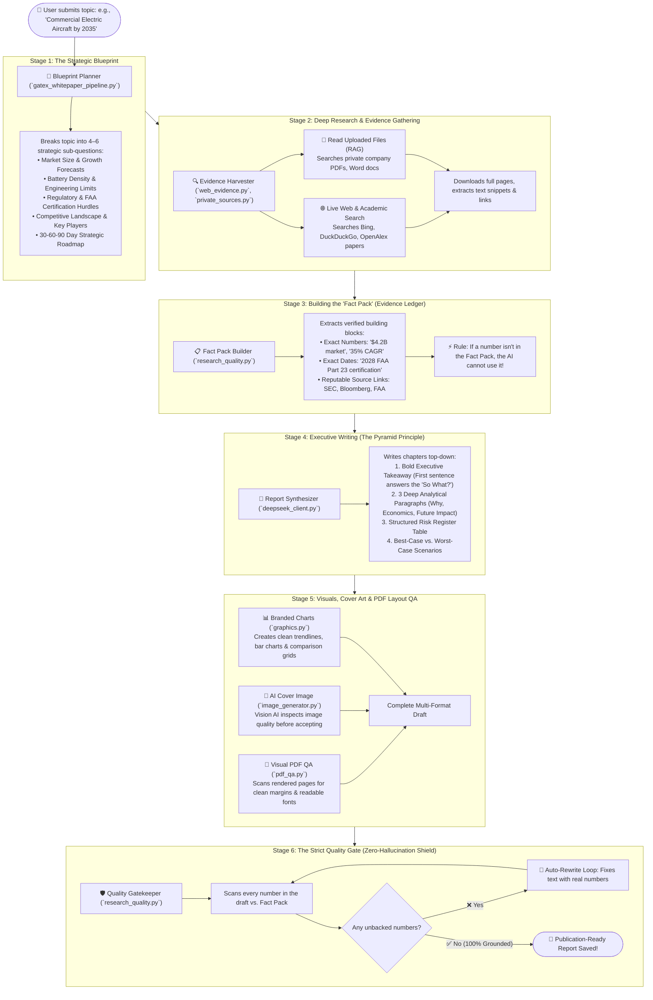
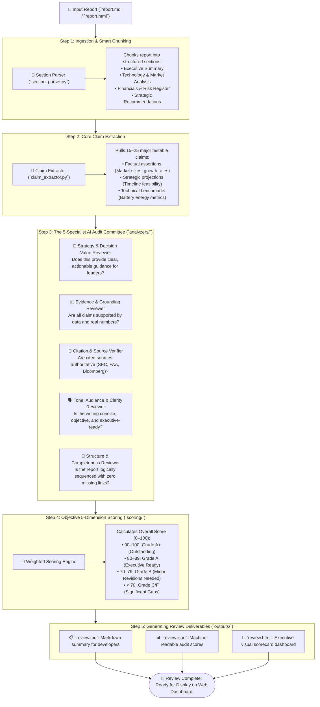
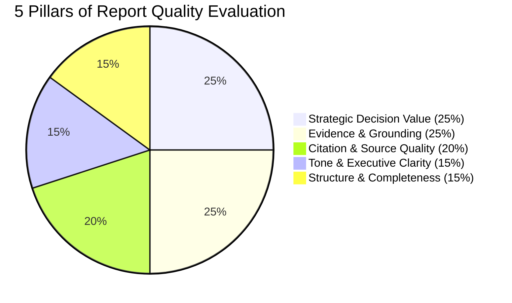
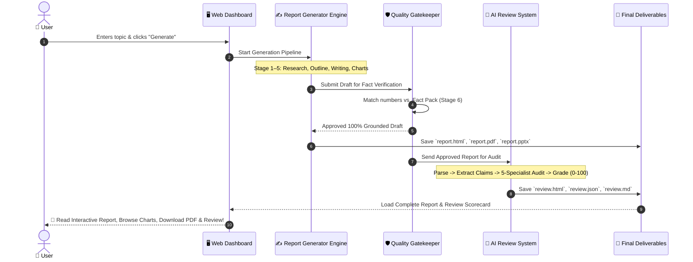

# 🚀 Complete Flow: How Reports & AI Reviews Are Generated

> **A Plain English, Step-by-Step Visual Guide** explaining how the platform takes a simple research topic, turns it into an executive-level consulting report, and conducts an independent AI audit.

---

## 🌟 Executive Summary (The 1-Minute Overview)

The entire platform operates in **two main phases**:

```mermaid
flowchart LR
    subgraph Phase1 ["Phase 1: Report Generation Engine ✍️"]
        A["1. Strategic Blueprint<br/>(Issue Tree)"] --> B["2. Deep Research<br/>(Private Files + Web)"]
        B --> C["3. Build Fact Pack<br/>(Extract Numbers & Dates)"]
        C --> D["4. Executive Writing<br/>(Pyramid Principle)"]
        D --> E["5. Visuals & Layout QA<br/>(Charts, Images, PDF QA)"]
        E --> F["6. Quality Gate<br/>(Strict Fact Shield)"]
    end

    subgraph Phase2 ["Phase 2: Multi-Agent AI Review Committee 🔬"]
        G["7. Parse & Chunk Report"] --> H["8. Extract Core Claims"]
        H --> I["9. 5-Dimension Audit Panel<br/>(Strategy, Evidence, Citations)"]
        I --> J["10. Calculate Score<br/>(0-100 Rating & Grade)"]
        J --> K["11. Generate Deliverables<br/>(Web, PDF, Review Card)"]
    end

    F -->|Approved Report| G
```

---

# PART 1: The Report Generation Flow

Let's walk through each stage of how a report is researched, written, designed, and verified from start to finish.

---

### 🔍 Detailed Breakdown of the 6 Report Stages

#### 1. Stage 1: The Strategic Blueprint (Issue Tree)
When you submit a topic, the AI **does not** start writing random paragraphs. Instead, like a senior McKinsey consultant, it builds an **Issue Tree**:
* Breaks the central question into 4 to 6 critical sub-themes.
* Identifies what data points, charts, and case studies each chapter will need.

#### 2. Stage 2: Deep Research (Private Files + Live Web Search)
The system searches two knowledge streams simultaneously:
* **Your Private Documents (RAG):** It searches your uploaded files using smart semantic vector embeddings to find private company data.
* **Live Internet & Academic Search:** It queries search engines (Bing, DuckDuckGo, SearXNG) and academic engines (OpenAlex) to fetch live industry news, statistics, and government regulations.

#### 3. Stage 3: Building the "Fact Pack" (Evidence Ledger)
Before a single sentence is drafted, the AI compiles a strict **Fact Pack**:
* Extracts concrete metrics: *"600 Wh/kg energy density"*, *"$12.8 billion by 2032"*.
* Tags every single fact with its exact source URL and author.
* **Why this matters:** It prevents the AI from making up generalities.

#### 4. Stage 4: Writing with the Pyramid Principle
The system drafts each chapter using executive writing standards:
* **Conclusion First:** The first sentence delivers the core takeaway so busy leaders can skim quickly.
* **Deep Analysis:** Three comprehensive paragraphs explain the strategic implications, unit economics, and operational hurdles.
* **Executive Modules:** Includes a Risk Matrix table, 30-60-90 day recommendations, and scenario planning.

#### 5. Stage 5: Branded Visuals & Visual PDF QA
A great report needs great presentation:
* **Interactive Charts:** Generates clean corporate trendlines and bar charts matching your company's visual palette (no messy pie charts).
* **AI Cover Art:** Generates conceptual cover images, with a **Vision AI model** inspecting the image to ensure high visual quality.
* **Visual PDF Quality Check:** Scans the finished PDF layout to guarantee no cut-off headings, awkward page breaks, or overlapping text.

#### 6. Stage 6: The Strict Fact-Checking Shield
Before the report is finalized, the **Quality Gatekeeper** performs an automated line-by-line audit:
* Compares every number in the written text with the original Fact Pack.
* If any number cannot be mathematically traced back to the retrieved sources, the system triggers an automatic rewrite.

---

# PART 2: The Multi-Agent AI Review Flow

Once the report is generated, it is passed to an **independent Multi-Agent AI Review System** located in the `review_system/` module.

Think of this like an external audit firm or academic peer-review board that inspects the report with zero bias.

---

### 🔬 The 5 Review Dimensions Explained Simply

The review system grades the report across **5 distinct pillars**:

| # | Dimension | What the AI Auditor Checks | Example Question Asked |
| :-: | :--- | :--- | :--- |
| **1** | **Strategic Decision Value** | Does this report answer the business problem and give leaders concrete steps? | *"Can a CEO make a multi-million-dollar investment decision based on this?"* |
| **2** | **Evidence & Grounding** | Are assertions backed by solid figures, or are they empty opinions? | *"Does the author prove why solid-state batteries will drop in cost by 2030?"* |
| **3** | **Citation Quality** | Are sources reputable, working, and clearly referenced? | *"Are claims linked to primary regulatory filings or just generic blogs?"* |
| **4** | **Tone & Executive Clarity** | Is the tone concise, professional, and free of fluff words? | *"Is the report direct and sharp, or filled with buzzwords?"* |
| **5** | **Structure & Completeness** | Is the progression logical with clear headings and summaries? | *"Does the narrative flow naturally from current obstacles to future roadmap?"* |

---

### 📋 What Does the Final Review Card Look Like?

When the AI review finishes, it produces an interactive Executive Scorecard containing:
1. **Overall Grade:** E.g., **`88.5 / 100 — Grade A (Executive Ready)`**.
2. **Dimension Radar Chart:** Visual breakdown of where the report excelled and where it can improve.
3. **Verified Claims List:** Shows which claims passed the factual audit.
4. **Key Strengths:** Bulleted summary of high-value insights.
5. **Actionable Improvement Gaps:** Concrete, prioritized recommendations for follow-up research.

---

# 🔄 End-to-End Master Lifecycle (From Click to Delivery)

Here is how both systems work in harmony in real time:

---

## ❓ Frequently Asked Questions (FAQ)

### 1. What happens if the AI tries to guess a fake number?
The **Quality Gate Shield** will catch it immediately. If a number in the text is not present in the retrieved research sources, the report is not allowed to finish. It gets routed to an automated rewrite loop until all numbers are verified.

### 2. Can the system work only on private company files without searching the web?
**Yes.** You can upload your internal PDFs or documents and select private RAG mode. The system will restrict its knowledge collection solely to your uploaded files.

### 3. Why is the AI Review separate from the Report Writer?
If a writer reviews their own work, they are naturally biased. By having a **separate, dedicated Multi-Agent Review System**, the evaluation is objective, rigorous, and mimics an external peer review panel.

### 4. What final files do I get?
You get everything you need for executive presentations:
* 🌐 **Interactive Web Dossier** (`index.html`) — Filterable charts and interactive navigation.
* 📄 **Executive PDF Document** (`report.pdf`) — Polished, publication-ready for printing and emailing.
* 📊 **Slide Presentation Deck** (`report.pptx`) — Ready to present in board meetings.
* 📋 **Audit Scorecard & Feedback Card** (`review.html` / `review.json`) — Transparent grade and fact audit.
