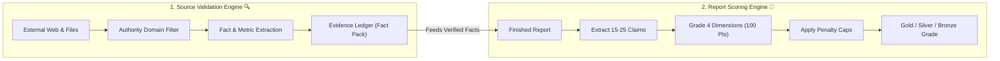
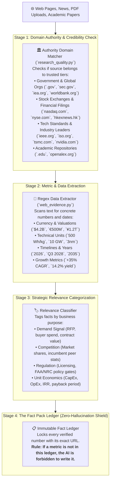
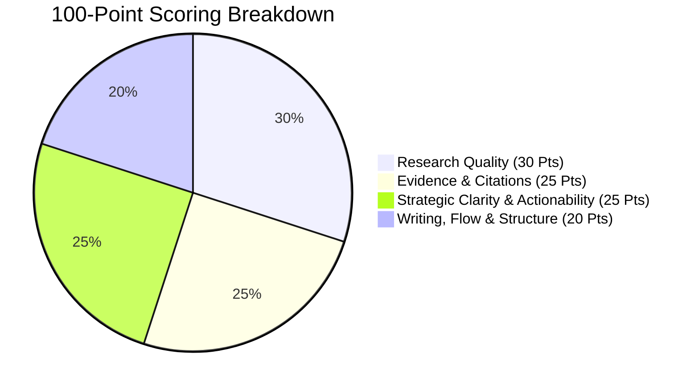
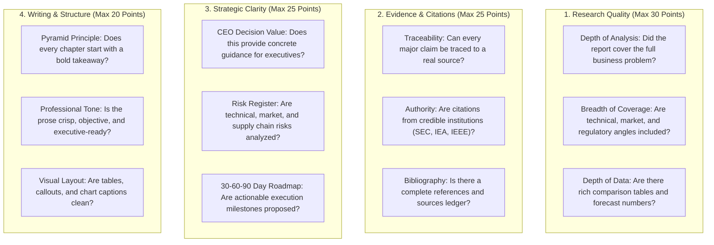
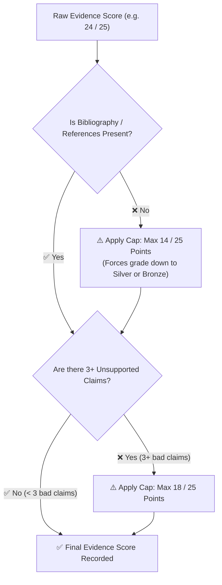
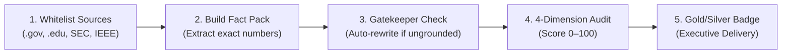

# 🔍 Source Validation & Report Scoring Guide (In Simple Words)

> **A Complete, Step-by-Step Visual Guide** explaining how the platform verifies external web & private sources, eliminates fake numbers (hallucinations), and calculates transparent 0–100 quality scores for every generated report.

---

## 🌟 The Big Picture: Trust & Verification

When AI writes business reports, the two most common problems are:
1. **Bad Sources:** Relying on random blog posts, outdated rumours, or low-quality websites.
2. **AI Hallucinations:** Making up fake statistics, fake revenue figures, or unproven timelines.

**Gen-Rpt solves both problems with two automated systems:**
* **Source Validator (`gen_rpt`):** Filters, parses, and verifies every web link and private document before writing starts.
* **Objective Scoring Engine (`review_system`):** Grades completed reports across 4 dimensions (0–100 scale) with hard penalties for unverified claims.



---

# PART 1: How Sources Are Validated

The system does not treat all websites equally. It runs every external and private source through a **4-stage verification filter**:



---

### 🏛️ 1. Domain Authority Tiers (Who Do We Trust?)

The system maintains a built-in whitelist of high-authority domains to ensure reports rely on primary evidence:

| Tier | Category | Examples of Accepted Sources | Why Trusted |
| :-: | :--- | :--- | :--- |
| **Tier 1** | **Government & International Bodies** | `sec.gov`, `energy.gov`, `iea.org`, `worldbank.org`, `who.int`, `oecd.org` | Official statistics, legal filings, and macro data. |
| **Tier 2** | **Financial Exchanges & Filings** | `nasdaq.com`, `nyse.com`, `hkexnews.hk`, `sse.com.cn`, `londonstockexchange.com` | Audited financial disclosures and quarterly earnings reports. |
| **Tier 3** | **Official Engineering & Standards Bodies** | `ieee.org`, `iso.org`, `ietf.org`, `ashrae.org`, `opencompute.org` | Ground-truth technical limits and safety benchmarks. |
| **Tier 4** | **First-Party Technology Leaders** | `tsmc.com`, `nvidia.com`, `intel.com`, `qualcomm.com`, `deepseek.com`, `samsung.com` | Official product datasheets and manufacturing process nodes. |
| **Tier 5** | **Academic & Research Papers** | `.edu`, `science.osti.gov`, `nationalacademies.org`, `openalex.org` | Peer-reviewed scientific discoveries and laboratory trials. |

> [!NOTE]
> Random blogs, anonymous forum posts, and unverified aggregation sites are down-weighted or filtered out.

---

### 🔒 2. Anti-Hallucination: How Numbers Are Checked

When the AI writes a sentence like:
> *"The solid-state battery market will reach **$12.5 billion** by **2032**, growing at a **34.2% CAGR**."*

The **Quality Gatekeeper (`research_quality.py`)** performs an automated backward-lookup:
1. It pulls the tokens: `$12.5 billion`, `2032`, and `34.2%`.
2. It searches the **Fact Pack**.
3. **If found:** The sentence is approved.
4. **If not found:** The sentence is flagged as a potential hallucination and sent back for an automated rewrite using only verified numbers.

---

# PART 2: How Report Scores Are Calculated

After the report is written, the independent **AI Review System (`review_system/`)** audits the document and scores it from **0 to 100 points**.



---

### 📊 The 4 Scoring Dimensions



---

### 🛡️ Automatic Penalty Caps (Hard Guardrails)

To guarantee high standards, the system applies **strict score caps** in code (`evidence_score.py`):



1. **Missing Bibliography Penalty:** If a report fails to include a references/works cited section, the Evidence score is **capped at a maximum of 14 / 25 points**.
2. **Unsupported Claims Penalty:** If 3 or more claims in the report cannot be verified against evidence, the Evidence score is **capped at a maximum of 18 / 25 points**.

---

### 🏅 The Letter Grade System

Based on the total combined score out of 100, each report receives an official executive tier:

| Grade Tier | Total Score | Status | What It Means |
| :-: | :-: | :-: | :--- |
| 🥇 **Gold** | **90 – 100** | **Publication Ready** | World-class consulting grade. 100% verified evidence, rich data charts, and sharp strategic recommendations. |
| 🥈 **Silver** | **75 – 89** | **Executive Ready** | High-quality report suitable for leadership review. Solid facts with minor optional improvements. |
| 🥉 **Bronze** | **60 – 74** | **Revisions Needed** | Adequate draft, but requires additional source citations, deeper data tables, or clearer strategic actions. |
| 🔴 **Red** | **< 60** | **High Risk / Reject** | Report contains multiple ungrounded assertions, missing citations, or shallow analysis. Needs total regeneration. |

---

## 📋 Example of What the Review Output Looks Like

When the review finishes, the system generates `review.json` and an interactive dashboard `review.html`:

```json
{
  "total_score": 88,
  "max_score": 100,
  "grade": "Silver",
  "breakdown": {
    "research_quality": { "score": 27, "max": 30 },
    "evidence_and_citations": { "score": 22, "max": 25 },
    "strategic_clarity": { "score": 22, "max": 25 },
    "writing_and_structure": { "score": 17, "max": 20 }
  },
  "claims_audit": {
    "total_claims": 18,
    "supported_claims": 16,
    "partially_supported": 2,
    "unsupported_claims": 0
  },
  "key_strengths": [
    "Comprehensive unit economic breakdown of battery pack manufacturing costs.",
    "Authoritative citations from US Department of Energy and IEEE technical papers."
  ],
  "improvement_recommendations": [
    "Expand on China's supply chain dominance for raw lithium cathode refining."
  ]
}
```

---

## 💡 Summary Checklist: How Quality Is Guaranteed



1. **Sources are checked first:** Only credible domains and verified documents enter the system.
2. **Numbers are locked in a ledger:** AI is not allowed to guess facts.
3. **Drafts are fact-checked:** An automated shield blocks unproven assertions.
4. **Scored objectively:** Independent AI reviewers grade across 4 dimensions with strict penalty caps.
5. **Clear letter grade:** Executives can instantly see whether a report is **Gold (90+)**, **Silver (75+)**, or needs revision.
