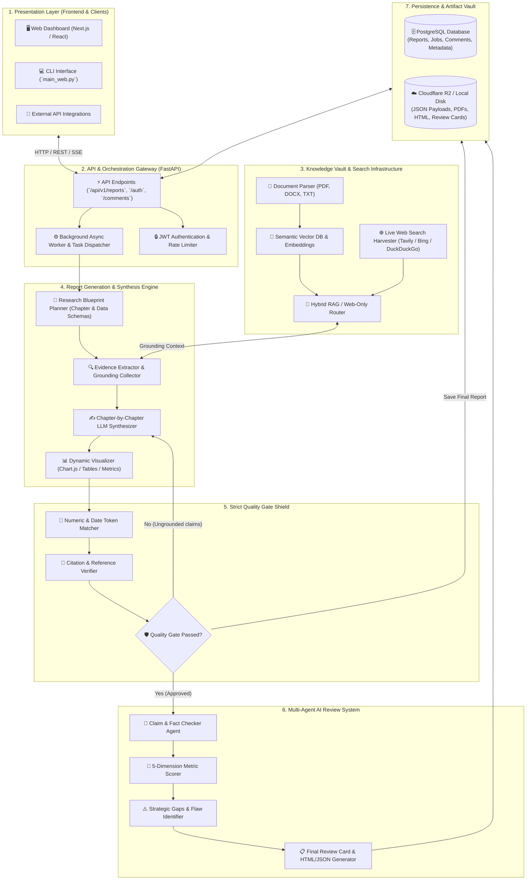
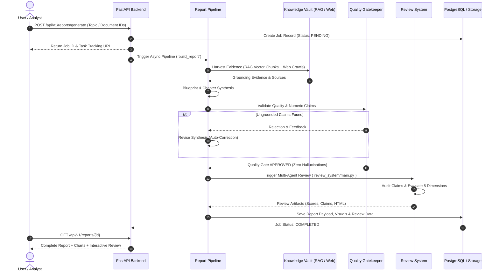

# 🏛️ Gen-Rpt System Architecture & Engineering Guide

Welcome to the comprehensive system architecture documentation for the **Gen-Rpt Autonomous Deep-Research & Multi-Agent Report Generation Platform**.

---

## 📑 Table of Contents
1. [Executive Overview](#1-executive-overview)
2. [End-to-End System Architecture](#2-end-to-end-system-architecture)
3. [Core Subsystems & Components](#3-core-subsystems--components)
   - [A. Presentation & User Interface](#a-presentation--user-interface)
   - [B. Backend & API Services (FastAPI)](#b-backend--api-services-fastapi)
   - [C. Knowledge Vault & Hybrid RAG Engine](#c-knowledge-vault--hybrid-rag-engine)
   - [D. Report Generation Pipeline & Synthesis Engine](#d-report-generation-pipeline--synthesis-engine)
   - [E. Quality Gatekeeper & Strict Fact-Checking Shield](#e-quality-gatekeeper--strict-fact-checking-shield)
   - [F. Multi-Agent AI Review System (Post-Generation)](#f-multi-agent-ai-review-system-post-generation)
   - [G. Persistence, Database & Cloud Storage](#g-persistence-database--cloud-storage)
4. [Data Flow & Execution Lifecycle](#4-data-flow--execution-lifecycle)
5. [Security, Performance & Resilience](#5-security-performance--resilience)

---

## 1. Executive Overview

**Gen-Rpt** is an enterprise-grade autonomous intelligence and deep-research report generation platform. It is engineered to transform high-level research topics or private document collections into publication-ready, citation-grounded, multi-chapter research dossiers complete with interactive data visualizations and independent multi-agent peer reviews.

### Key Architectural Tenets
* **Zero Hallucination Tolerance:** Strict automated numeric and factual verification guarantees claims are mathematically and textually grounded in retrieved evidence.
* **Hybrid Dual-Mode Intelligence:** Transparent fallback between private RAG document vaults and public web intelligence.
* **Independent Automated Peer Review:** Every generated report undergoes a 5-dimension audit by a dedicated AI review committee.
* **Modern Modular Stack:** Decoupled FastAPI backend, async job orchestration, semantic vector search, and responsive visualization.

---

## 2. End-to-End System Architecture

---

## 3. Core Subsystems & Components

### A. Presentation & User Interface
* **Web Dashboard:** Interactive single-page application enabling users to submit topics, upload source files, monitor live generation progress, view interactive charts, read multi-chapter reports, and view detailed peer-review scorecards.
* **CLI & CI/CD Interface:** Direct command-line access (`python -m gen_rpt.main_web`) for scheduled or automated GitHub Actions pipeline batch jobs.

---

### B. Backend & API Services (FastAPI)
* **Directory:** `report-management-backend/app/`
* **FastAPI Application:** RESTful endpoints covering report management, generation lifecycle, commenting, document uploading, and system health.
* **Async Task Engine:** Handles asynchronous long-running research pipelines without blocking incoming client requests.

---

### C. Knowledge Vault & Hybrid RAG Engine
* **Directory:** `report-management-backend/app/services/knowledge_processing/` & `gen_rpt/`
* **Private RAG Mode:** Parses uploaded enterprise documents, chunks text, creates high-dimensional vector embeddings, and stores them in the vector database.
* **Public Web-Only Mode:** If no matching private documents exist for the topic, the system automatically routes queries to live web harvesters to gather real-time data from authoritative sources.

---

### D. Report Generation Pipeline & Synthesis Engine
* **Directory:** `gen_rpt/web_report_pipeline.py`, `gen_rpt/web_publication_contract.py`
* **Blueprint Planning:** Deconstructs research queries into structured chapters, targeted sub-queries, and data visualization requirements.
* **Context Synthesis:** Orchestrates advanced LLMs (via OpenRouter / DeepSeek / Qwen) to draft rigorous academic/executive chapters with inline citations.
* **Dynamic Visualization:** Generates embedded Chart.js configurations, comparative data grids, and summary callouts.

---

### E. Quality Gatekeeper & Strict Fact-Checking Shield
* **Verification Logic:** `validate_report_content_quality` in `gen_rpt/web_publication_contract.py`.
* **Zero Hallucination Check:**
  1. Extracts all numeric values, dates, percentages, and financial metrics from the drafted text.
  2. Compares extracted tokens against the unified grounding evidence context.
  3. If unverified numbers are detected, triggers automated synthesis revisions (up to 3 iterations) to eliminate hallucinations.

---

### F. Multi-Agent AI Review System (Post-Generation)
* **Directory:** `review_system/`
* **Claim Extraction & Auditing:** Identifies 10–20 key factual claims in the generated report and tests them against the evidence base.
* **5-Dimension Scoring:**
  - **Accuracy & Grounding** (25%)
  - **Analytical Depth** (25%)
  - **Structure & Narrative** (20%)
  - **Clarity & Readability** (15%)
  - **Actionability & Strategic Value** (15%)
* **Artifact Generation:** Produces `review.json`, `scores.json`, `claims.json`, `findings.json`, and an interactive `review.html` scorecard.

---

### G. Persistence, Database & Cloud Storage
* **PostgreSQL:** Manages transactional state, report metadata, audit trails, and user permissions.
* **Cloudflare R2 / Local Storage:** Persists finalized report payloads (`web_report_payload.json`), compiled HTML, PDF artifacts, and review bundles under `/reports_web/<slug>/`.

---

## 4. Data Flow & Execution Lifecycle

---

## 5. Security, Performance & Resilience

| Architecture Domain | Implementation Strategy |
| :--- | :--- |
| **Data Privacy** | Private document embeddings remain isolated per workspace/user. No data training leakage. |
| **API Resilience** | Multi-tier retry logic with exponential backoff and automatic provider fallback. |
| **Execution Speed** | Fast multi-agent review with optimized LLM pipelines executing in under 2 minutes. |
| **Cost Optimization** | Intelligent caching of web harvest queries and vector embeddings. Zero unnecessary token burn. |
| **Auditability** | Complete JSON artifacts preserved for every generation step, evidence chunk, and claim audit. |

---
*Document Version: 2.1.0*  
*Last Updated: August 2026*
