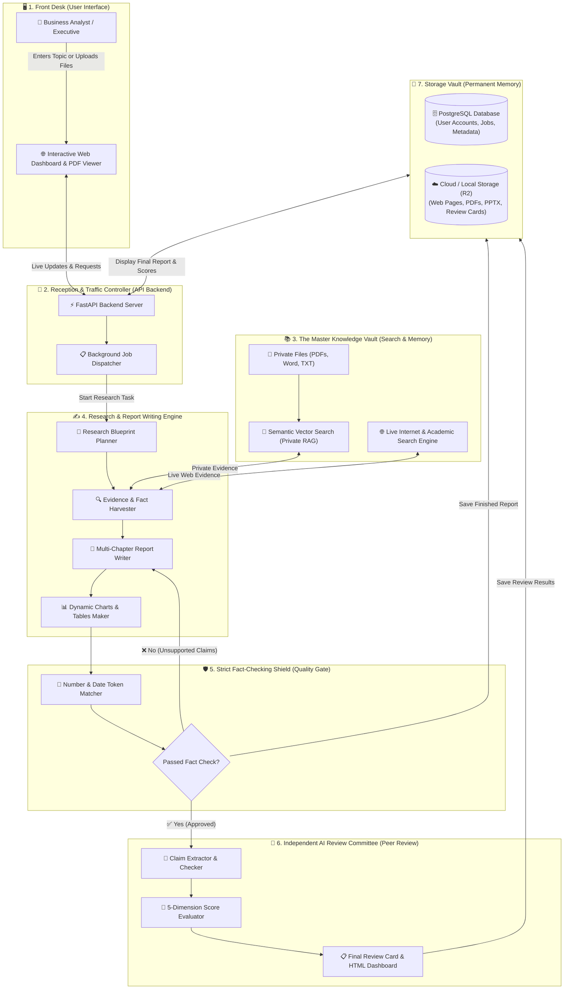
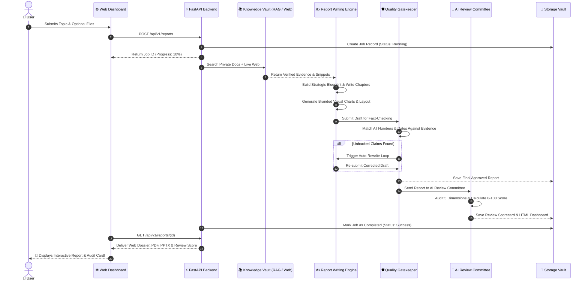

# 🏛️ Gen-Rpt System Architecture — A Simple & Visual Guide

> **Welcome!** This document explains the complete architecture of the **Gen-Rpt Autonomous Deep-Research Platform** in simple, everyday language. You don't need a computer science degree to understand this—clear diagrams and real-world analogies make every part easy to follow.

---

## 🌟 1. What is Gen-Rpt in Plain English?

Imagine you run a company and need a comprehensive 25-page consulting report on a topic like **"The Future of Solid-State Batteries by 2035"**.

Normally, you would have to:
1. Hire a team of research analysts to search the internet and read hundreds of PDFs.
2. Hire a business consultant to structure the arguments and write chapters.
3. Hire a graphic designer to create clean, branded charts and cover pages.
4. Hire a strict fact-checker to verify every single number and date.
5. Hire an independent audit board to peer-review the report before giving it to the CEO.

**Gen-Rpt is an AI-powered system that does all of this automatically in just 3 to 5 minutes.**

---

## 🗺️ 2. The Big Picture (Bird's-Eye Architecture Diagram)

Here is a visual map showing how all parts of the system connect together, from your web browser down to the databases:

---

## 🧩 3. The 6 Main Components (Explained with Work Analogies)

To make the architecture intuitive, let's compare each part of the system to a role in a top-tier consulting firm:

```mermaid
classDiagram
    class FrontDeskInterface {
        The Friendly Receptionist
        - Easy form to submit research topics
        - Real-time progress bar with live feedback
        - Interactive web viewer and PDF downloads
    }
    class MasterLibrarian {
        The Knowledge Vault (RAG & Web)
        - Reads company internal documents
        - Searches live internet and academic journals
        - Collects only verified, factual source quotes
    }
    class LeadAnalyst {
        The Report Writing Engine
        - Breaks big topics into strategic questions
        - Writes deep, executive-level chapters
        - Creates branded data charts and tables
    }
    class StrictFactChecker {
        The Anti-Hallucination Shield
        - Scans every number, date, and statistic
        - Compares claims directly against collected sources
        - Forces rewrites if any claim is unproven
    }
    class IndependentReviewBoard {
        The Multi-Agent AI Review Board
        - Tests major claims like a peer-review panel
        - Grades quality across 5 areas (0-100 score)
        - Delivers an actionable scorecard with recommendations
    }
    class SecureArchive {
        The Storage & File Vault
        - Stores project records in PostgreSQL
        - Safely hosts PDFs, slides, and web reports in Cloud storage
    }
```

---

### 1. 🖥️ The Front Desk (Web Interface & API Gateway)
* **What it is:** The webpage you see in your browser and the fast backend server ([FastAPI](https://fastapi.tiangolo.com/)) behind it.
* **What it does:** 
  - Gives you a clean box to type your topic or upload internal files.
  - Shows you a live progress bar while the AI does research.
  - Delivers the completed report on screen, with buttons to download **PDF**, **PowerPoint (PPTX)**, or **Executive Web Report**.

---

### 2. 📚 The Master Librarian (Knowledge Vault & Dual Search)
* **What it is:** A dual-source search engine that combines private internal documents with live public web data.
* **How it works:**
  - **Private Documents (RAG):** When you upload files (PDFs, Word documents, text notes), the system chops them into searchable pieces and stores their semantic meaning in a vector database.
  - **Public Web Search:** If your topic requires recent news, market sizes, or regulations, the system searches the live internet and academic databases (like OpenAlex, Bing, DuckDuckGo).
  - **The Output:** A clean collection of source snippets with real links and author citations.

---

### 3. ✍️ The Lead Analyst & Author (Report Writing Engine)
* **What it is:** The AI brain that designs the report structure and writes every chapter.
* **How it works:**
  - **No rushed summaries:** It does not try to guess or write 30 pages at once.
  - **The Outline (Issue Tree):** It breaks the main topic into 4 to 6 strategic questions.
  - **Deep Executive Writing:** It writes each chapter using the **Pyramid Principle** (starting with the big conclusion first, followed by in-depth evidence and analysis).
  - **Visuals & Charts:** Automatically builds clean data charts, comparison tables, and risk registers.

---

### 4. 🛡️ The Strict Fact-Checker (Quality Gate Shield)
* **What it is:** A zero-hallucination security filter that inspects the draft before anyone can see it.
* **How it works:**
  - Extracts every number, percentage, dollar figure, and date in the written text.
  - Searches backwards into the collected evidence to verify if that exact number really exists.
  - **The Golden Rule:** If a number was invented or cannot be proven by a verified source, the text is immediately rejected and sent back for an automated rewrite.

---

### 5. 🔬 The Independent Review Board (Multi-Agent AI Review System)
* **What it is:** A completely independent team of AI agents that reads the completed report like an external audit committee.
* **How it works:**
  - It extracts 15 to 25 core factual and strategic claims.
  - Evaluates the report across **5 critical dimensions**:
    1. *Strategic Decision Value* (Does this help executives make real decisions?)
    2. *Evidence Grounding* (Are all claims backed by solid data?)
    3. *Citation Quality* (Are source links reputable and accurate?)
    4. *Executive Tone & Clarity* (Is the language professional and punchy?)
    5. *Structure & Flow* (Is the report logically organized?)
  - Generates a transparent scorecard (e.g., **`88.5 / 100 — Grade A`**) along with concrete improvement tips.

---

### 6. 💾 The Storage Vault (Database & Cloud Storage)
* **What it is:** The permanent digital filing cabinet.
* **How it works:**
  - **PostgreSQL Database:** Tracks user logins, project status, timestamps, and job history.
  - **Cloud / Disk Storage (Cloudflare R2 or Local):** Stores the generated HTML files, high-resolution PDFs, PowerPoint decks, and review JSON scorecards so they are always fast to load.

---

## 🔄 4. How Data Travels: Step-by-Step Sequence

Here is what happens behind the scenes from the moment you click **"Generate Report"**:

---

## 💡 5. Why This Architecture Stands Out

| Feature | Typical AI Chatbots (ChatGPT / Basic Tools) | Gen-Rpt Architecture |
| :--- | :--- | :--- |
| **Output Length** | 1–3 pages of generic summary | **15–30 pages of deep, structured executive intelligence** |
| **Fact Reliability** | Can hallucinate fake numbers | **Strict Automated Fact Shield (Zero-Hallucination Gate)** |
| **Data Sources** | Static training data only | **Dual Engine: Internal Private Files + Live Web Search** |
| **Visuals** | Plain text / markdown only | **Branded interactive charts, comparison tables & diagrams** |
| **Quality Audit** | None (you have to verify everything) | **Independent Multi-Agent AI Review with 0–100 scoring** |
| **Export Formats** | Copy-paste raw text | **Interactive Web App, Executive PDF, PowerPoint & JSON** |

---

## 🎯 Summary

The **Gen-Rpt** system is designed like a modern digital factory:
1. **Input:** You give a question or business topic.
2. **Research:** It reads both your private files and the live web.
3. **Writing & Visuals:** It crafts deep executive chapters and interactive charts.
4. **Verification:** Strict software checks ensure zero fake numbers.
5. **Peer Review:** An independent AI audit committee grades the work.
6. **Delivery:** You get a publication-ready Web Report, PDF, and PowerPoint ready for executive leadership.
