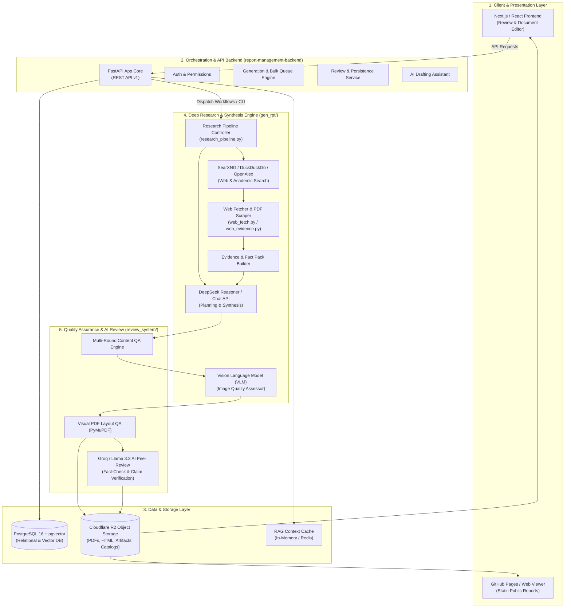
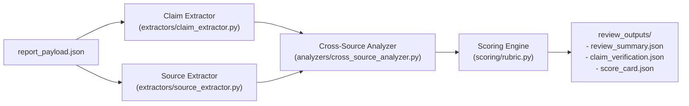
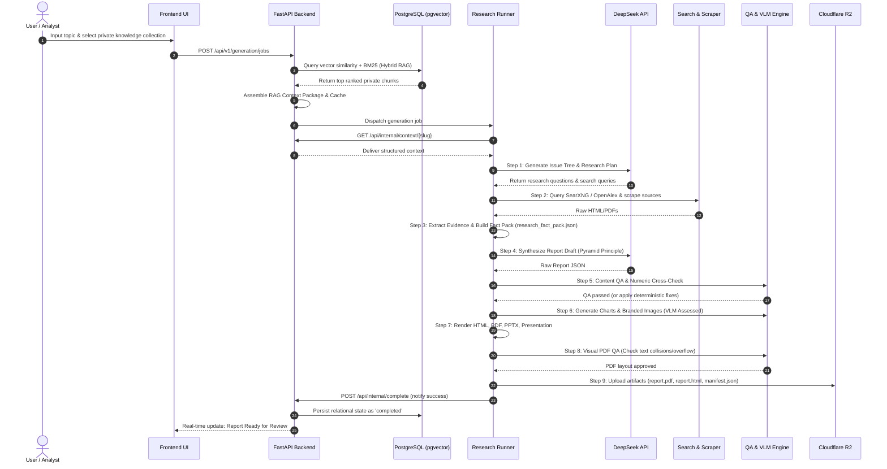

# gen_rpt — Complete System Documentation & Architectural Deep Dive

> **Authoritative Full-System Reference Manual**  
> **Repository Baseline:** `yt-feng/gen_rpt` (`gen_rpt-main`)  
> **Deliverable Formats:** `HTML` | `Markdown` | `PDF` | `PPTX` | `Keynote Presentation`

---

## 1. Executive Summary & Problem Solved

**gen_rpt** is an enterprise-grade, automated **Deep Research Intelligence & Report Generation System**. It takes a single research topic, user prompt, or collection of private enterprise documents and autonomously conducts full-scale research to produce **management-consulting-grade intelligence publications** matching the visual and editorial standards of firms like McKinsey, BCG, and Bain.

### Core Capabilities & Deliverables
1. **Interactive Web Report (`report.html` / `index.html`)**: Dynamic single-page web presentation featuring interactive charts, collapsible sections, citation inspector modals, and evidence audit trails.
2. **Publication-Ready PDF (`report.pdf`)**: Formal publication complete with cover page, table of contents, executive summary, vector graphics, risk tables, and legal disclaimers.
3. **Executive Presentation Deck (`report.pptx` & `presentation.html`)**: 16:9 widescreen PowerPoint and standalone HTML5 animated slide decks for executive briefings.
4. **Machine-Readable Payloads (`report.md`, `report_payload.json`, `evidence_ledger.json`)**: Structured data structures enabling downstream integrations, API delivery, and audit trails.

---

## 2. Global Architecture Overview



---

## 3. Comprehensive Breakdown of Every Single Part

### 3.1 `gen_rpt/` (Research & Synthesis Core)

| File / Component | Purpose & Internal Mechanics |
| :--- | :--- |
| **`deepseek_client.py`** | High-reliability API client for DeepSeek-R1 / DeepSeek-V3 with rate-limit backoff, token budgeting, prompt compression, streaming wrappers, and automatic JSON repair. |
| **`research_pipeline.py`** | Central orchestrator executing the 10-step research workflow: topic parsing, issue tree generation, query decomposition, parallel scraping, fact pack extraction, synthesis, and rendering. |
| **`web_report_pipeline.py`** | Specialized pipeline variant tailored for interactive web formats (`reports_web/`), handling dynamic JSON schema generation and asset linking. |
| **`web_fetch.py`** | Multi-provider scraper querying SearXNG, DuckDuckGo, Bing HTML, and direct HTTP URLs with anti-bot bypass and PDF extraction. |
| **`web_evidence.py`** | Parses raw HTML/PDF text into structured `EvidenceLedger` records, tagging authoritative domains (SEC, Gov, IEEE, financial filings), numeric facts, and timelines. |
| **`openalex_fetch.py`** | Academic search bridge querying the OpenAlex scholarly database for peer-reviewed literature citations. |
| **`private_sources.py`** | Connects internal document repositories and RAG vector search results into the primary evidence pool with strict confidentiality isolation. |
| **`graphics.py`** | Matplotlib-based high-DPI chart rendering engine applying consulting-style visual themes (no pie charts, clean bar/line charts, dual y-axes, callout badges, CJK font fallbacks). |
| **`image_generator.py`** | AI image generation wrapper (DALL-E 3 / Flux) responsible for generating cover art, infographic visual cards, and conceptual diagrams. |
| **`pdf_renderer.py` & `gatex_pdf_renderer.py`** | WeasyPrint / Playwright / Typst PDF generation engines converting semantic HTML templates into pixel-perfect PDF publications. |
| **`ppt_renderer.py`** | `python-pptx` compiler converting synthesized executive summaries and risk matrices into 16:9 widescreen PowerPoint presentation decks. |
| **`presentation_renderer.py`** | Generates standalone, keyboard-navigable HTML5 presentation slides with animations and speaker notes. |
| **`pdf_qa.py`** | Automated visual layout QA analyzing output PDFs using PyMuPDF (`fitz`): detects overlapping text, font anomalies, orphan headings, layout overflows, and meta-tag leaks. |
| **`research_quality.py`** | Semantic validation rule-engine checking for: 7–10 structured sections, minimum 3 paragraphs per section, numeric fact density, and ban of generic filler words. |
| **`theme.py` & `brand_assets.py`** | Central repository design tokens (colors, typography, spacing, logo paths) defined in `branding/theme.json`. |

---

### 3.2 `report-management-backend/` (FastAPI Management & Orchestration Service)

Built on **FastAPI**, **SQLAlchemy 2.0 (Async)**, and **PostgreSQL (with pgvector)**:

- **`app/api/v1/endpoints/`**:
  - `generation.py`: Research job triggers, bulk queue state management, RAG context preview.
  - `reports.py`: Document lifecycle management, PDF/HTML downloads, status transitions.
  - `comments.py`: Review comment threads, line-level annotations, resolution actions.
  - `editor.py`: Document AST node-level locking, collaborative editing, autosave.
  - `ai_assistant.py`: In-editor generative AI rewriting and citation suggestion.
  - `auth.py` & `assignments.py`: User JWT authentication and human reviewer queue assignment.
  - `internal.py`: Secure handshake tokens between backend and GitHub Actions runners.
- **`app/models/`**: SQLAlchemy 2.0 Async ORM models mapped to PostgreSQL:
  - `Document` & `DocumentVersion`: Stores metadata, lifecycle states, and schema versions.
  - `DocumentSection` & `DocumentBlock`: Fine-grained AST nodes of report content.
  - `HumanReview` & `ReviewComment`: Tracks human feedback and thread status.
  - `KnowledgeCollection`, `KnowledgeDocument`, `KnowledgeChunk`: Enterprise RAG repository storing chunked text and vector embeddings (`vector(384)`).
- **`app/services/`**:
  - `review_service.py`: Status persistence, comment logging, and pessimistic row locking (`with_for_update`).
  - `retrieval_engine.py`: Hybrid search combining pgvector cosine similarity (70%) and BM25 keyword score (30%) via Reciprocal Rank Fusion (RRF).

---

### 3.3 `review_system/` (Automated AI Peer Review Subsystem)

A dedicated multi-agent subsystem powered by **Groq / Llama-3.3-70B-Versatile**:



1. **Claim Extraction**: Isolates all quantitative statements, statistics, growth rates, and market forecasts.
2. **Cross-Source Corroboration**: Cross-references claims against gathered sources to detect hallucinations or misattributions.
3. **Multi-Dimensional Rubric Scoring**: Scores the report on Depth, Empirical Rigor, Actionability, Style Consistency, and Source Quality.
4. **Structured Review Manifest**: Emits pass/warn/fail grades written to `review_outputs/` and Cloudflare R2.

---

### 3.4 `storage/` (Cloudflare R2 Storage & Global Registry)

- **`r2_client.py`**: High-performance async client for Cloudflare R2 bucket transactions.
- **`catalog_manager.py`**: Maintains `catalog.json`, a global index of all published research reports, categories, generation dates, and summary tags.
- **`manifest_manager.py`**: Maintains `manifest.json`, recording file checksums, download links (PDF, PPTX, HTML, JSON), and review verification stamps for each report.
- **`upload_report.py` / `upload_review.py`**: CLI and workflow tools for atomic bucket uploads.

---

### 3.5 `tools/` (Developer, Bridge & Audit Tooling)

- **`gatex_generation_bridge.py` / `gatex_release_bridge.py`**: Specialized bridge transforming Deep Research findings into institutional whitepapers and crypto-economic research for the GateX ecosystem.
- **`regenerate_image.py`**: Features an integrated **Vision Language Model (VLM) assessor** that inspects generated image bytes for visual artifacts (blurry faces, distorted hands, cartoonish artifacts) and retries generation with a new seed if quality falls below threshold.
- **`local_report_audit.py` / `local_web_report_audit.py`**: Command-line verification utilities for inspecting generated reports locally without a cloud deployment.
- **`rerender_existing_report.py`**: Re-compiles HTML, PDF, and PPTX files from saved JSON payloads after template or CSS adjustments.

---

## 4. End-to-End Execution Flow (Step-by-Step)



### Detailed Lifecycle Phases

1. **Topic Ingestion & RAG Context Assembly**:
   - The user enters a topic (e.g., *"Commercial Aviation SAF Transition 2026-2035"*) and optional knowledge collections.
   - `retrieval_engine.py` generates query embeddings using `BAAI/bge-small-en-v1.5`, executes pgvector cosine similarity search, runs keyword scoring, and merges results using **Reciprocal Rank Fusion (RRF)**.
   - A structured context snapshot under a 6,000-token budget is cached by report slug.

2. **Autonomous Deep Research & Fact Packing**:
   - DeepSeek generates a hierarchical issue tree, identifying key strategy questions and external search queries.
   - `web_fetch.py` executes parallel search queries across SearXNG, DuckDuckGo, Bing, and OpenAlex, downloading pages and official PDFs.
   - `web_evidence.py` categorizes verified data points, numeric metrics, timelines, and authoritative source URLs into `research_fact_pack.json`.

3. **Synthesis & Pyramid Principle Structuring**:
   - DeepSeek writes the full narrative following the **Pyramid Principle**: conclusions first, 7–10 structured sections, executive action plan, risk register, and scenario vignettes.

4. **Quality Assurance & VLM Verification Gates**:
   - **Content QA (`research_quality.py`)**: Checks section depth, fact density, and citation grounding.
   - **Visual Asset Generation & VLM Inspection (`regenerate_image.py`)**: Charts and infographics are generated; a lightweight Vision Language Model inspects images for visual artifacts before approval.
   - **PDF QA (`pdf_qa.py`)**: Renders `report.pdf` and verifies with PyMuPDF for zero text-box collisions, no font sizes below 7pt, no orphaned headers, and no leaking internal meta-tags.

5. **Multi-Format Compilation & Cloud Distribution**:
   - Compiles `report.html`, `report.pdf`, `report.pptx`, `presentation.html`, and `report_payload.json`.
   - Uploads all artifacts to Cloudflare R2 and updates `catalog.json` and `manifest.json`.
   - Triggers the automated Groq/Llama-3.3 peer-review workflow to record independent fact-checking scores.

---

## 5. Persistence, Concurrency & Database Strategy

- **PostgreSQL Relational Persistence**: Volatile memory caches (`MOCK_REPORTS`, `MOCK_COMMENTS`) have been replaced with persistent tables (`Document`, `DocumentVersion`, `ReviewComment`).
- **Pessimistic Row Locking**: Document transitions and comment thread resolutions utilize PostgreSQL row locks (`with_for_update`) to prevent concurrent race conditions.
- **pgvector Search**: Indexes document embeddings (`vector(384)`) to support semantic search.

---

## 6. Deployment & Infrastructure

### Production VPS Configuration
- **Host**: Linux VPS (`207.148.75.21`)
- **Container Environment**: Docker Compose (`docker-compose.prod.yml`)
- **Port Mapping**: Host loopback `127.0.0.1:9000` mapped to internal FastAPI container `8000`.
- **Health Endpoint**: `GET /health` monitored continuously, verifying database connectivity, R2 latency, pgvector readiness, and worker queue health.

### GitHub Actions CI/CD Workflows
1. **`generate_deep_research.yml`**: Dispatches report generation jobs on GitHub runners for high-CPU workloads.
2. **`generate_review.yml`**: Listens for report completion and triggers automated Groq/Llama review.
3. **`publish_reports_pages.yml`**: Publishes web-ready reports to GitHub Pages.

---

## 7. Directory & File Reference Map

```text
gen_rpt-main/
├── SYSTEM_OVERVIEW_AND_ARCHITECTURE.md  # Complete system master documentation
├── branding/                            # Theme tokens & vector logos
│   ├── theme.json
│   └── logo.svg
├── bulk_generation/                     # Multi-report batch dispatch engine
│   └── dispatch_bulk.py
├── doc/                                 # Architecture & operational guides
│   ├── COMPLETE_SYSTEM_ARCHITECTURE_AND_OPERATION_MANUAL.md
│   ├── RELATIONAL_PERSISTENCE_ARCHITECTURE.md
│   ├── RAG_HYBRID_RETRIEVAL_ARCHITECTURE.md
│   └── VPS_PRODUCTION_MIGRATION_GUIDE.md
├── gen_rpt/                             # Core intelligence & rendering engine
│   ├── deepseek_client.py               # LLM API interface & prompt sanitization
│   ├── research_pipeline.py             # 10-step Deep Research orchestrator
│   ├── web_fetch.py                     # Multi-provider scraper & PDF downloader
│   ├── web_evidence.py                  # Fact pack & evidence ledger builder
│   ├── openalex_fetch.py                # Scholarly publication API integration
│   ├── graphics.py                      # Branded Matplotlib chart generator
│   ├── image_generator.py               # AI visual card & infographic generator
│   ├── pdf_qa.py                        # Automated PyMuPDF layout validator
│   ├── pdf_renderer.py                  # WeasyPrint / Playwright PDF compiler
│   ├── ppt_renderer.py                  # 16:9 PowerPoint generator
│   └── presentation_renderer.py         # HTML5 slide presentation generator
├── report-management-backend/           # FastAPI backend service
│   ├── app/
│   │   ├── api/v1/endpoints/            # REST API route handlers
│   │   ├── models/                      # PostgreSQL & pgvector SQLAlchemy models
│   │   ├── services/                    # Business logic (RAG, review, locks)
│   │   └── tests/                       # Pytest test suites
│   ├── Dockerfile
│   └── docker-compose.prod.yml
├── review_system/                       # Groq/Llama 3.3 automated peer review
│   ├── extractors/                      # Claim & source parsers
│   ├── analyzers/                       # Cross-source verification logic
│   └── scoring/                         # Multi-dimensional rubric scoring
├── storage/                             # Cloudflare R2 bucket integration
│   ├── r2_client.py                     # Async S3 client wrapper
│   ├── catalog_manager.py               # Global report index maintainer
│   └── manifest_manager.py              # Report artifact checksum & release tracker
├── tools/                               # Developer utilities & integration bridges
│   ├── gatex_generation_bridge.py       # Whitepaper pipeline bridge
│   ├── regenerate_image.py              # VLM quality assessor & retry loop
│   └── rerender_existing_report.py      # Template re-rendering tool
└── new_worklog.md                       # Development history & task log
```
