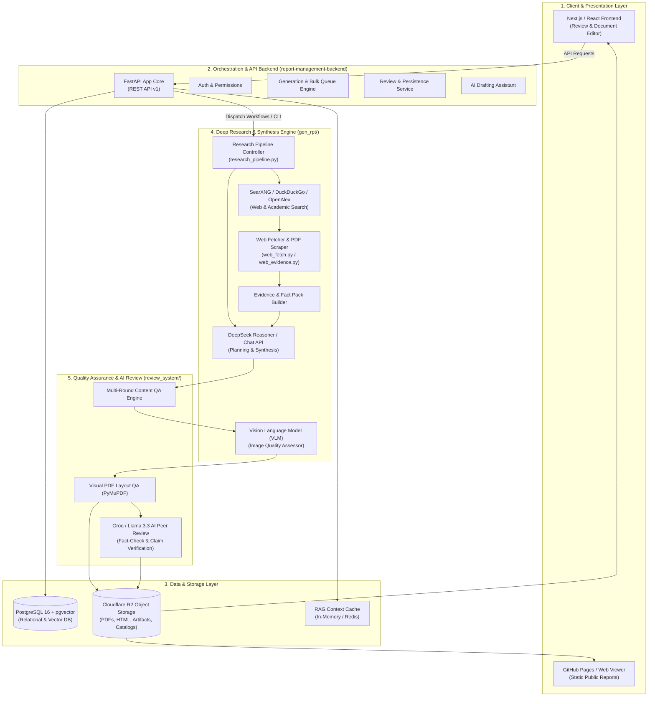
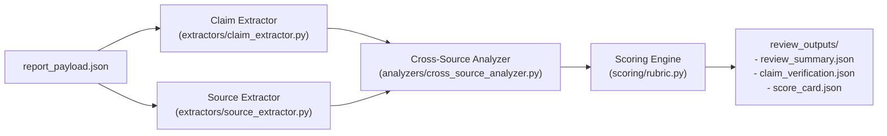
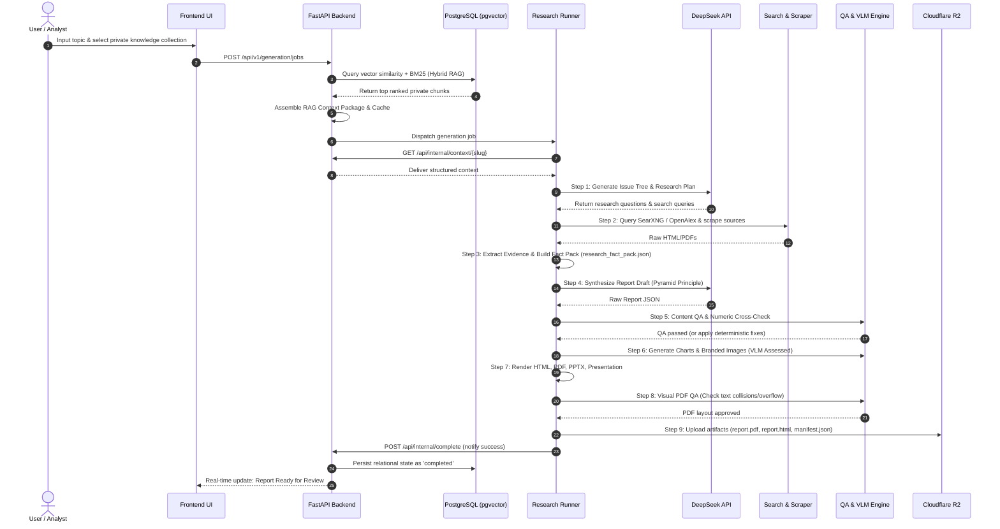

# gen_rpt: Complete End-to-End System Architecture & Technical Operations Manual

---

## 1. Executive Summary & Purpose

**gen_rpt** is an enterprise-grade, automated **Deep Research Intelligence & Report Generation System**. It takes a single research topic, user prompt, or collection of private enterprise documents and autonomously produces **management-consulting-grade research reports** matching the visual and editorial standards of firms like McKinsey, BCG, and Bain.

The system outputs synchronized multi-format deliverables:
- **Interactive Web Reports (`report.html` / `index.html`)**: Dynamic, responsive web presentations with collapsible sidebars, interactive charts, and evidence inspection panels.
- **Publication-Ready PDFs (`report.pdf`)**: Formal publications complete with corporate cover pages, executive summaries, table of contents, high-resolution vector charts, callout boxes, and legal disclaimers.
- **Executive Slide Decks (`report.pptx` & `presentation.html`)**: Branded presentation slides for CEO and board-level briefings.
- **Raw Structured Payloads & Markdown (`report.md`, `report_payload.json`, `evidence_ledger.json`)**: Machine-readable data structures enabling downstream integrations, API delivery, and audit trails.

---

## 2. Global Architecture Overview



---

## 3. Component-by-Component Deep Dive

### 3.1 `gen_rpt/`: The Deep Research & Multi-Format Generation Core

The `gen_rpt` package contains the core intelligence, research orchestration, web crawling, data synthesis, and rendering logic.

| Module | Exact Role & Technical Mechanism |
| :--- | :--- |
| **`deepseek_client.py`** | High-reliability API client for DeepSeek-R1 and DeepSeek-V3. Features automatic exponential backoff, JSON payload sanitization, streaming wrappers, and context truncation protection. |
| **`research_pipeline.py`** | Central orchestrator executing the 10-step research workflow: topic parsing, issue tree generation, query decomposition, parallel scraping, fact pack extraction, synthesis, and rendering. |
| **`web_report_pipeline.py`** | Specialized pipeline variant tailored for interactive web formats (`reports_web/`), handling dynamic JSON schema generation and asset linking. |
| **`web_fetch.py`** | Resilient web scraper with bot detection bypass, header randomization, charset auto-detection, HTML-to-clean-text sanitization, and direct PDF downloading. |
| **`web_evidence.py`** | Evidence extraction engine that transforms raw HTML/PDF text into structured `EvidenceLedger` records, tagging authoritative sources (e.g., SEC, Gov, IEEE), numeric claims, and event dates. |
| **`openalex_fetch.py`** | Integration with the OpenAlex scholarly database to find peer-reviewed academic papers, citations, and DOI-backed findings. |
| **`private_sources.py`** | Connects internal document repositories and RAG vector search results into the primary evidence pool with strict confidentiality isolation. |
| **`graphics.py`** | Matplotlib-based high-DPI chart rendering engine applying consulting-style visual themes (no pie charts, clean bar/line charts, dual y-axes, callout badges). |
| **`image_generator.py`** | AI image generation wrapper (DALL-E 3 / Flux) responsible for generating cover art, infographic visual cards, and conceptual diagrams. |
| **`pdf_renderer.py` & `gatex_pdf_renderer.py`** | WeasyPrint / Playwright / Typst PDF generation engines converting semantic HTML templates into pixel-perfect PDF publications. |
| **`ppt_renderer.py`** | `python-pptx` compiler converting synthesized executive summaries and risk matrices into 16:9 widescreen PowerPoint presentation decks. |
| **`presentation_renderer.py`** | Generates standalone, keyboard-navigable HTML5 presentation slides with animations and speaker notes. |
| **`pdf_qa.py`** | Automated visual layout QA analyzing output PDFs using PyMuPDF (`fitz`): detects overlapping text, font anomalies, orphan headings, layout overflows, and meta-tag leaks. |
| **`research_quality.py`** | Semantic validation rule-engine checking for: 7–10 structured sections, minimum 3 paragraphs per section, numeric fact density, and ban of generic filler words. |
| **`theme.py` & `brand_assets.py`** | Central repository design tokens (colors, typography, spacing, logo paths) defined in `branding/theme.json`. |

---

### 3.2 `report-management-backend/`: Enterprise API & Orchestration Service

Built on **FastAPI**, **SQLAlchemy 2.0 (Async)**, and **PostgreSQL (with pgvector)**, this service manages documents, user workflows, RAG search, and human-in-the-loop review.

```text
report-management-backend/
├── app/
│   ├── api/v1/endpoints/
│   │   ├── auth.py             # User authentication, JWT issuance, permissions
│   │   ├── reports.py          # Report CRUD, status transitions, export triggers
│   │   ├── generation.py       # Research job dispatching, bulk generation queue
│   │   ├── comments.py         # Threaded comments, annotations, review resolutions
│   │   ├── editor.py           # Document drafting, autosave, node-level locking
│   │   ├── ai_assistant.py     # In-editor AI rewrite and citation suggestion
│   │   ├── aigateway.py        # Centralized LLM proxy with token quotas
│   │   ├── assignments.py      # Human reviewer queues and workflow assignments
│   │   ├── dashboard.py        # Aggregated analytics, generation metrics
│   │   └── internal.py         # Secure backend-to-runner IPC handshakes
│   ├── core/                   # Global configuration (config.py), CORS, security
│   ├── database/               # Async engine session management, connection pooling
│   ├── models/                 # SQLAlchemy ORM models (Document, Review, Knowledge)
│   ├── services/               # Core business logic:
│   │   ├── review_service.py   # Relational persistence & pessimistic row locking
│   │   ├── retrieval_engine.py # Hybrid RAG search (Cosine + BM25 via RRF)
│   │   ├── validation_service.py
│   │   └── conflict_service.py
│   └── workers/                # Background tasks (Celery/AsyncIO workers)
```

#### Relational Data Model
- **`Document` & `DocumentVersion`**: Stores metadata, lifecycle states (`draft`, `generating`, `in_review`, `published`), and schema versions.
- **`DocumentSection` & `DocumentBlock`**: Fine-grained AST nodes of report content enabling block-level real-time collaborative editing and AI rewriting.
- **`HumanReview` & `ReviewComment`**: Tracks human feedback, thread status (`open`, `resolved`), and line-level anchor tags.
- **`KnowledgeCollection`, `KnowledgeDocument`, `KnowledgeChunk`**: Enterprise RAG repository storing chunked text and vector embeddings (`vector(384)`).

---

### 3.3 `review_system/`: Automated AI Peer Review & Fact-Checking

A dedicated multi-agent subsystem powered by **Groq / Llama-3.3-70B-Versatile** that audits generated reports prior to publication:



1. **Claim Extraction**: Isolates all quantitative statements, statistics, growth rates, and market forecasts.
2. **Cross-Source Corroboration**: Cross-references claims against the gathered sources to detect hallucinations or misattributions.
3. **Multi-Dimensional Rubric Scoring**: Scores the report on Depth, Empirical Rigor, Actionability, Style Consistency, and Source Quality.
4. **Structured Review Manifest**: Emits pass/warn/fail grades written to `review_outputs/` and Cloudflare R2.

---

### 3.4 `storage/`: Cloudflare R2 Object Storage & Registry

High-performance, S3-compatible cloud storage layer managed by `r2_client.py`:
- **`catalog_manager.py`**: Maintains `catalog.json`, a global index of all published research reports, categories, generation dates, and summary tags.
- **`manifest_manager.py`**: Maintains `manifest.json`, recording file checksums, download links (PDF, PPTX, HTML, JSON), and review verification stamps for each report.
- **`upload_report.py` / `upload_review.py`**: CLI and workflow tools for atomic bucket uploads.

---

### 3.5 `bulk_generation/`: Large-Scale Research Dispatcher

- **`dispatch_bulk.py`**: Reads `jobs.json`, manages batch execution queues, throttles concurrent API requests against LLM rate limits, logs job states, and triggers GitHub Action runners or local worker threads.

---

### 3.6 `tools/`: Operational, Audit & Bridge Tooling

- **`gatex_generation_bridge.py` / `gatex_release_bridge.py`**: Specialized bridge transforming Deep Research findings into institutional whitepapers and crypto-economic research for the GateX ecosystem.
- **`regenerate_image.py`**: Features an integrated **Vision Language Model (VLM) assessor** that inspects generated image bytes for visual artifacts (blurry faces, distorted hands, cartoonish artifacts) and retries generation with a new seed if quality falls below threshold.
- **`local_report_audit.py` / `local_web_report_audit.py`**: Command-line verification utilities for inspecting generated reports locally without a cloud deployment.
- **`rerender_existing_report.py`**: Re-compiles HTML, PDF, and PPTX files from saved JSON payloads after template or CSS adjustments.

---

## 4. End-to-End Execution Flow (Step-by-Step)



### Detailed Lifecycle Phases

#### Phase 1: Topic Ingestion & RAG Context Assembly
1. The user provides a research topic (e.g., *"Commercial Aviation SAF Transition 2026-2035"*) and optional internal knowledge collection IDs.
2. If RAG is enabled, `retrieval_engine.py` embeds the query via `BAAI/bge-small-en-v1.5`, executes cosine similarity search in `pgvector`, runs keyword matching, and merges results using **Reciprocal Rank Fusion (RRF)**.
3. The top context chunks are assembled into a structured snapshot under a 6,000-token budget and cached by report slug.

#### Phase 2: Autonomous Deep Research & Fact Packing
1. **Planning**: DeepSeek generates a hierarchical issue tree, identifying core strategy questions, technical hurdles, financial implications, and targeted external web search queries.
2. **Information Gathering**: `web_fetch.py` executes search queries across SearXNG, DuckDuckGo, Bing, and OpenAlex, downloading pages and official PDFs.
3. **Fact Pack Construction**: `web_evidence.py` parses raw texts and builds `research_fact_pack.json`, categorizing verified data points, numeric metrics, timelines, and authoritative source URLs.

#### Phase 3: Synthesis & Pyramid Principle Structuring
1. The report draft is synthesized adhering to the **Pyramid Principle**:
   - Conclusions first (*crisp & sharp* section leads).
   - Structured Executive Summary and CEO-facing Action Plan.
   - Comprehensive Risk Register and Scenario Vignettes.
   - Elimination of filler language, vague adjectives, and informal structures.

#### Phase 4: Quality Assurance & VLM Verification Gates
1. **Content QA (`research_quality.py`)**: Checks that sections (7–10), charts (5–7), and source attributions strictly match the compiled fact pack.
2. **Visual Asset Generation & VLM Inspection (`regenerate_image.py`)**: Branded infographics and charts are generated. A lightweight Vision Language Model inspects images for visual artifacts, blurriness, or limb anomalies, automatically retrying with new seeds if needed.
3. **PDF QA (`pdf_qa.py`)**: Renders `report.pdf` and verifies with PyMuPDF for zero text-box collisions, no font sizes below 7pt, no orphaned headers, and no leaking internal meta-tags.

#### Phase 5: Multi-Format Compilation & Cloud Distribution
1. Compiles synchronized outputs: `report.html`, `report.pdf`, `report.pptx`, `presentation.html`, and `report_payload.json`.
2. Syncs all artifacts to Cloudflare R2 bucket storage.
3. Updates `catalog.json` and `manifest.json`.
4. Triggers the secondary AI peer-review workflow (`review_system/`) to record independent fact-checking scores.

---

## 5. Persistence & Concurrency Strategy

### 5.1 Elimination of In-Memory Caches
Previously, volatile in-memory dictionary stores (`MOCK_REPORTS`, `MOCK_COMMENTS`) were used for fast prototyping. The system has been fully refactored to **PostgreSQL Relational Persistence**:
- Report status logs are written to and read from `Document` and `DocumentVersion` tables.
- Human review comments, threaded replies, and audit flags are persisted in the `ReviewComment` table.

### 5.2 Pessimistic Row Locking
To eliminate race conditions during concurrent reviewer actions:
- Status transitions and comment resolutions utilize PostgreSQL row-level locks:
  ```python
  stmt = select(Document).where(Document.id == doc_id).with_for_update()
  res = await db.execute(stmt)
  ```
- This ensures that parallel edits, automated AI reviewer writes, and human approvals never overwrite each other.

---

## 6. Deployment & Infrastructure

### 6.1 Production VPS Architecture
- **Host**: Linux VPS (`207.148.75.21`)
- **Container Environment**: Docker Compose (`docker-compose.prod.yml`)
- **Port Mapping**: Host loopback `127.0.0.1:9000` mapped to internal FastAPI container `8000`.
- **Health Endpoint**: `GET /health` monitored continuously, verifying database connectivity, R2 latency, pgvector readiness, and worker queue health.

### 6.2 GitHub Actions CI/CD & Automation Workflows
1. **`generate_deep_research.yml`**: Dispatches report generation jobs on GitHub runners for high-CPU workloads (Playwright, WeasyPrint, Chromium).
2. **`generate_review.yml`**: Listens for report completion and triggers automated Groq/Llama review.
3. **`publish_reports_pages.yml`**: Publishes web-ready reports to GitHub Pages.

---

## 7. Summary Directory & File Map

```text
gen_rpt-main/
├── branding/                       # Corporate theme tokens & vector logos
│   ├── theme.json
│   └── logo.svg
├── bulk_generation/                # Multi-report batch dispatch engine
│   └── dispatch_bulk.py
├── doc/                            # Architecture reports & migration manuals
│   ├── COMPLETE_SYSTEM_ARCHITECTURE_AND_OPERATION_MANUAL.md
│   ├── RELATIONAL_PERSISTENCE_ARCHITECTURE.md
│   ├── RAG_HYBRID_RETRIEVAL_ARCHITECTURE.md
│   └── VPS_PRODUCTION_MIGRATION_GUIDE.md
├── gen_rpt/                        # Core intelligence & multi-format rendering
│   ├── deepseek_client.py          # LLM API interface & prompt sanitization
│   ├── research_pipeline.py        # 10-step Deep Research orchestrator
│   ├── web_fetch.py                # Multi-provider scraper & PDF downloader
│   ├── web_evidence.py             # Fact pack & evidence ledger builder
│   ├── openalex_fetch.py           # Scholarly publication API integration
│   ├── graphics.py                 # Branded Matplotlib chart generator
│   ├── image_generator.py          # AI visual card & infographic generator
│   ├── pdf_qa.py                   # Automated PyMuPDF layout validator
│   ├── pdf_renderer.py             # WeasyPrint / Playwright PDF compiler
│   ├── ppt_renderer.py             # 16:9 PowerPoint generator
│   └── presentation_renderer.py    # HTML5 slide presentation generator
├── report-management-backend/      # FastAPI backend service
│   ├── app/
│   │   ├── api/v1/endpoints/       # REST API route handlers
│   │   ├── models/                 # PostgreSQL & pgvector SQLAlchemy models
│   │   ├── services/               # Business logic (RAG, review, locks)
│   │   └── tests/                  # Pytest test suites
│   ├── Dockerfile
│   └── docker-compose.prod.yml
├── review_system/                  # Groq/Llama 3.3 automated peer review
│   ├── extractors/                 # Claim & source parsers
│   ├── analyzers/                  # Cross-source verification logic
│   └── scoring/                    # Multi-dimensional rubric scoring
├── storage/                        # Cloudflare R2 bucket integration
│   ├── r2_client.py                # Async S3 client wrapper
│   ├── catalog_manager.py          # Global report index maintainer
│   └── manifest_manager.py         # Report artifact checksum & release tracker
├── tools/                          # Developer utilities & integration bridges
│   ├── gatex_generation_bridge.py  # Whitepaper pipeline bridge
│   ├── regenerate_image.py         # VLM quality assessor & retry loop
│   └── rerender_existing_report.py # Template re-rendering tool
└── new_worklog.md                  # Development history & task log
```
