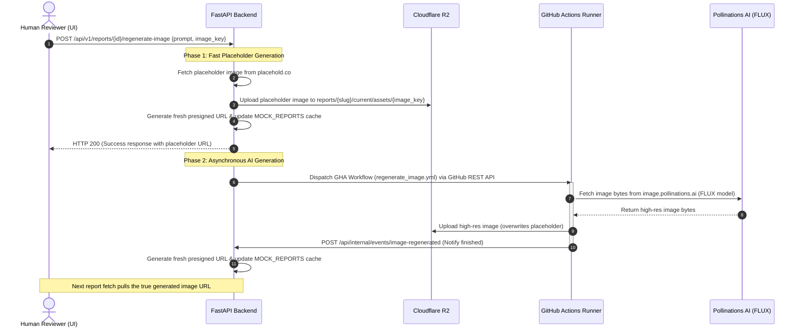

# AI Image Regeneration Workflow

This document explains the technical architecture and step-by-step lifecycle of the **AI Image Regeneration Workflow** used by human reviewers to update report image assets.

---

## Overview

The image regeneration workflow allows a reviewer to completely regenerate a specific report image asset (e.g. `image-1.png`) based on a custom text description prompt. 

To prevent request timeouts or blocking on the main web server during slow AI generation runs, the process operates in a **dual-phase asynchronous loop** using a fast-response placeholder API and background execution via **GitHub Actions**.

---

## System Components

1. **Review UI (Frontend)**: Captures user prompts and triggers the image update request.
2. **FastAPI Backend (`report-management-backend`)**: Manages the API endpoints, updates the cached report metadata, and dispatches the background task.
3. **GitHub Actions Workflow (`regenerate_image.yml`)**: Runs an asynchronous job on an external runner.
4. **Pollinations AI (FLUX Model)**: Generates high-resolution, watermark-free images from text prompts.
5. **Cloudflare R2 (Object Storage)**: Persists generated assets at standard directory keys.

---

## Detailed Step-by-Step Lifecycle



### Phase 1: Synchronous Fast-Response (Placeholder)
1. The reviewer inputs a prompt describing the image in the UI and clicks "Regenerate".
2. The UI sends a `POST` request to `/{document_id}/regenerate-image` with the payload:
   ```json
   {
     "image_key": "image-1.png",
     "prompt": "A futuristic cleanroom in Abu Dhabi, blue ambient lights, high tech"
   }
   ```
3. The backend generates a temporary visual placeholder via `https://placehold.co/800x600/png?text=AI+Gen:+<prompt>`.
4. The placeholder bytes are uploaded to Cloudflare R2 at key `reports/{slug}/current/assets/{image_key}` (overwriting the old asset).
5. The backend cache is updated with a new presigned URL.
6. The backend immediately returns `200 OK` with the placeholder URL so the UI updates to show the action has started.

### Phase 2: Asynchronous AI Generation (GitHub Action)
7. The backend schedules the real generation by dispatching the `regenerate_image.yml` GitHub Actions workflow.
8. The GHA runner executes `tools/regenerate_image.py`.
9. The script calls `https://image.pollinations.ai/prompt/<quoted_prompt>` with the enhanced parameters to generate a clean, logo-free image using the **FLUX** model.
10. The downloaded high-resolution image is uploaded to R2, replacing the placeholder asset.
11. The script invokes the backend webhook at `/api/internal/events/image-regenerated` using the secure `x-internal-token` header.
12. The backend generates a fresh 1-hour presigned URL for the new image and updates `MOCK_REPORTS`. Subsequent client loads render the final high-resolution AI-generated image.

---

## Image Realism & Quality Resolution Analysis

### 1. Root Cause of Non-Realistic Images

Reviewers may notice that regenerated images look like cartoons, 3D CGI renders, or digital art illustrations rather than authentic real-world photographs. The root causes are:

*   **Default Model Checkpoint Drift**: Without style constraints, generative models (like FLUX) defaults to a stylized, CGI-like digital painting aesthetic to ensure high visual vibrance and contrast.
*   **The `enhance=true` Parameter Side-Effect**: The Pollinations AI API parameter `enhance=true` auto-injects random creative/artistic prompts (e.g. *"fantasy landscape, hyper-detailed render"*) behind the scenes. This actively overrides realism in favor of digital art aesthetics.
*   **Generic User Prompts**: Simple reviewer inputs like *"flooded street"* or *"tall buildings"* lack the camera, lighting, and medium directives required to trigger the model's photographic weights.

### 2. Logical Solutions to Enforce Photorealism

To resolve this and ensure that generated images look like realistic, professional photographs, apply the following logical solutions:

#### Solution A: Photographic Prompt Engineering Template
Prepend and append camera lens, lighting, and style instructions directly to the prompt.
*   **Photorealism Modifiers to Prepend**: `"A realistic, high-fidelity news photograph of..."` or `"A real-world documentary photograph of..."`
*   **Lens & Camera Details to Append**: `", shot on 35mm lens, f/8 aperture, natural sunlight, highly detailed, real-world texture, journalistic style, no CGI, no digital art"`
*   **Comparison Example**:
    *   *Bad (Generic)*: `"A flooded street with rescue workers and orange cars."` (Result: cartoonish illustration / CGI render).
    *   *Good (Photorealistic)*: `"A realistic, high-fidelity news photograph of a flooded city street with rescue workers in high-visibility gear wading through deep water near partially submerged cars, shot on 35mm lens, f/5.6, natural overcast daylight, real-world texture, journalistic style, photojournalism."`

#### Solution B: Code-Level API Query Parameter Refinements (Proposed)
Modifying the generator script parameters in `tools/regenerate_image.py`:
*   **Disable Automatic Enhancement**: Change `enhance=true` to `enhance=false`. This stops the API from injecting random artistic descriptors that skew the style.
*   **Enforce Photographic Model Checkpoint**: If supported by the endpoint provider, request the realism-tuned FLUX model checkpoint explicitly.
*   **Append Negative Styles**: Append negative modifiers to the prompt string programmatically inside `regenerate_image.py` (e.g. `prompt = f"{prompt}, realistic photo, real-world detail --no cartoon, 3d render, illustration, drawing"`).
