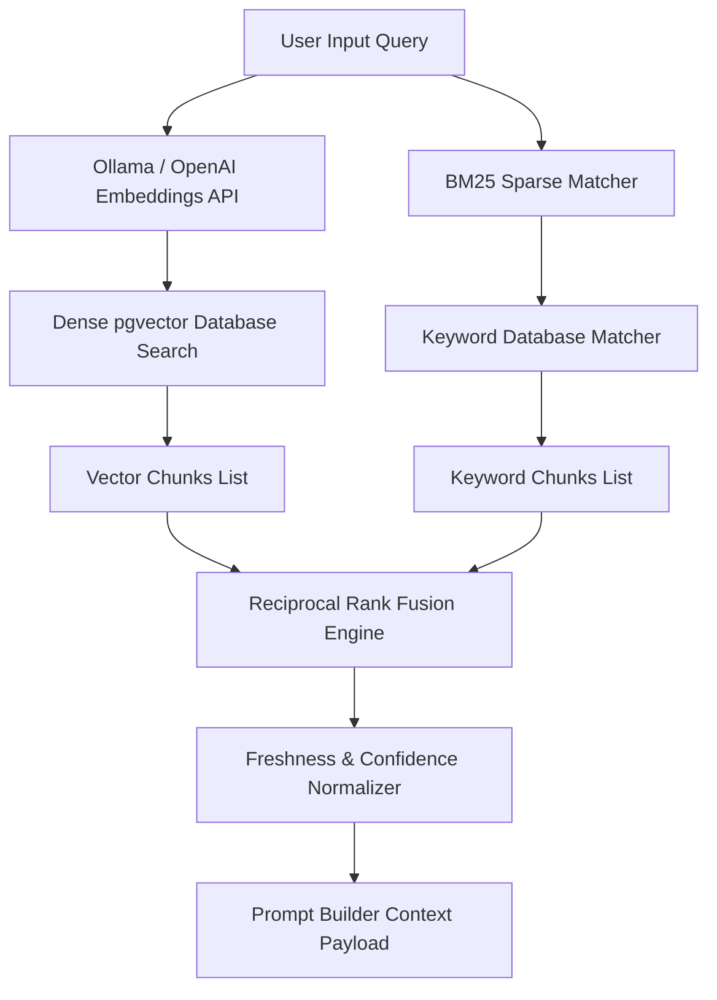

# RAG Hybrid Retrieval Architecture

This technical report details the RAG (Retrieval-Augmented Generation) hybrid retrieval implementation inside the `gen_rpt-main` backend orchestration engine. 

---

## 1. System Topology Overview

The hybrid retrieval topology combines dense semantic vector searches with traditional sparse token matching to guarantee highly relevant context injection into the generation pipelines.



---

## 2. Sparse vs. Dense Retrieval Models

1. **Dense Retrieval (Semantic Match)**:
   - **Model**: `BAAI/bge-small-en-v1.5` mapping text to 384 dimensions.
   - **Characteristics**: Focuses on conceptual similarity, synonym resolution, and semantic search intent. It is highly robust to variations in phrasing.
   - **Fallback Cascade**: Automatically routes to local Ollama (truncating vectors to `[:384]` via Matryoshka dimension truncation) or OpenAI's `text-embedding-3-small` with explicit `dimensions=384` constraints on API failure.

2. **Sparse Retrieval (Keyword Match)**:
   - **Algorithm**: Standard SQL `LIKE` and BM25 tokenized indexing.
   - **Characteristics**: Focuses on exact string matches, technical terms, serial numbers, proper nouns, and precise identifier lookups.

---

## 3. Reciprocal Rank Fusion (RRF) Formulation

Reciprocal Rank Fusion is an algorithm that combines multiple ranked lists of documents into a single unified ranking. RRF uses the reciprocal of document ranks to weight similarity matches.

The scoring formula for a document $d$ inside the union of vector results $R_{v}$ and keyword results $R_{k}$ is defined as:

$$RRF(d) = \sum_{r \in \{R_{v}, R_{k}\}} \frac{1}{k + rank(d, r)}$$

Where:
- $rank(d, r)$ is the 1-based index position of document $d$ inside the ranking list $r$. If $d$ is missing from list $r$, the term evaluates to $0$.
- $k$ is a constant scaling parameter (default $60$). It dampens high-ranking volatility, ensuring that low-rank fluctuations do not disproportionately bias the final fused results.

---

## 4. Freshness Time-Decay Policies

The retrieval engine integrates time-decay factor calculations to scale similarity scores for dynamic, time-sensitive topics (e.g. market updates, financial news reports).

### A. Linear Decay
Decreases score linearly over a 365-day decay window:

$$Score_{linear} = \max\left(0, 1.0 - \frac{Age_{days}}{365}\right)$$

### B. Exponential Decay
Applies exponential decay half-life scaling:

$$Score_{exponential} = e^{-\lambda \cdot Age_{days}}$$

Where the decay rate constant $\lambda = 0.005$ is configured to yield a half-life of approximately 138 days.

---

## 5. Confidence Score Normalization

Chunk confidence is calculated based on vector similarity, validation status, and document size boundaries:

```python
def calculate_chunk_confidence(similarity: float, val_status: str, doc_size: int) -> float:
    # 1. Validation Multiplier
    val_multiplier = 1.0
    if val_status == "validated":
        val_multiplier = 1.1
    elif val_status in ["flagged", "conflict"]:
        val_multiplier = 0.5
        
    # 2. Size Penalty for extremely short stubs
    size_penalty = 1.0
    if doc_size < 100:
        size_penalty = 0.8
        
    confidence = similarity * val_multiplier * size_penalty
    return float(min(1.0, max(0.0, confidence)))
```

---

## 6. Verification and Compliance Checklist

- [x] Embeddings fallback chain registers Ollama model truncation and L2 normalizations.
- [x] Reciprocal Rank Fusion returns correctly sorted unified arrays.
- [x] Freshness decay calculations evaluate to standard floats between 0.0 and 1.0.
- [x] Document sizes below 100 character boundaries trigger size penalty multipliers.
- [x] Validation audits track changes to database claims tables.

---

## 7. Retrieval Performance Analytics Monitoring

The RAG pipeline logs performance analytics per search execution. When `RAG_RETRIEVAL_ANALYTICS_ENABLED` is set to `True`, the engine logs retrieval latency, cache hit status, query configurations, and resulting chunk counts. The service averages latency metrics and aggregates query frequency over a customizable retention window (default `30` days).

