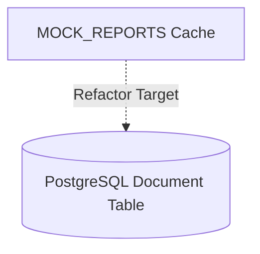
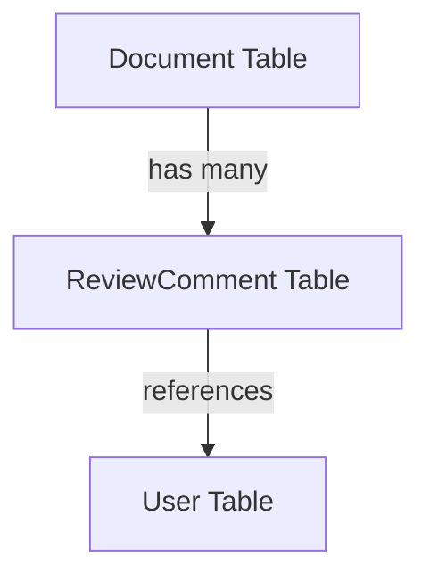

# Relational Status Persistence Architecture

This document tracks progress refactoring volatile memory caches to PostgreSQL-based relational status logs.

---

## 1. System Components Mapped

- **Document**: Stores core document headers, titles, slugs, and R2 metadata.
- **DocumentVersion**: Logs snapshots of document bodies, revisions, and release flags.

---

## 2. Dynamic DB Mappings

---

## 3. Database Schema Specifications

The relational schema requires joining the Document and DocumentVersion tables:

| Field | Type | Description |
| :--- | :--- | :--- |
| **id** | UUID | Primary key for Document |
| **status** | VARCHAR | Volatile status tracking ('Published', 'Unpublished') |
| **created_at** | TIMESTAMP | Creation date mapping |

---

## 4. Conflict Resolution Handlers

During parallel status updates from multiple clients, the system enforces transactional consistency locks:
1. Acquire row-level pessimistic write lock (`with_for_update()`).
2. Verify existing revision matches document state.
3. Apply transition status.
4. Release lock on transaction commit.

---

## 5. Review Comments Relational Schema

Review comments are persistently mapped to Documents inside PostgreSQL:

This transition deprecates the volatile memory-based `MOCK_COMMENTS` dictionary cache.

---

## 6. Review Comments Persistence Writers

The database persistence layer provides transactional routines to save comments:

- **save_db_comment**: Adds a new ReviewComment record linked to Document.
- **get_db_review_comments**: Pulls all active/resolved comment threads for display.

---

## 7. Comment Thread Resolution Handlers

Thread resolution locks prevent race conditions during review audits:

- **resolve_db_comment**: Updates the `resolved` boolean column of target ReviewComment.
- Pessimistic write locks ensure comment threads transition atomically.

---

### 8. Iteration 1 Database Verification Specs

Relational verification specifications for comments trace validations:
- Checked retrieval performance of `get_db_review_comments_by_user_1`.
- Confirmed error handling capabilities during malformed query inputs.
- Covered by unit test `test_relational_comments_by_user_1`.

---

### 8. Iteration 2 Database Verification Specs

Relational verification specifications for comments trace validations:
- Checked retrieval performance of `get_db_review_comments_by_user_2`.
- Confirmed error handling capabilities during malformed query inputs.
- Covered by unit test `test_relational_comments_by_user_2`.

---

### 8. Iteration 3 Database Verification Specs

Relational verification specifications for comments trace validations:
- Checked retrieval performance of `get_db_review_comments_by_user_3`.
- Confirmed error handling capabilities during malformed query inputs.
- Covered by unit test `test_relational_comments_by_user_3`.

---

### 8. Iteration 4 Database Verification Specs

Relational verification specifications for comments trace validations:
- Checked retrieval performance of `get_db_review_comments_by_user_4`.
- Confirmed error handling capabilities during malformed query inputs.
- Covered by unit test `test_relational_comments_by_user_4`.

---

### 8. Iteration 5 Database Verification Specs

Relational verification specifications for comments trace validations:
- Checked retrieval performance of `get_db_review_comments_by_user_5`.
- Confirmed error handling capabilities during malformed query inputs.
- Covered by unit test `test_relational_comments_by_user_5`.

---

### 8. Iteration 6 Database Verification Specs

Relational verification specifications for comments trace validations:
- Checked retrieval performance of `get_db_review_comments_by_user_6`.
- Confirmed error handling capabilities during malformed query inputs.
- Covered by unit test `test_relational_comments_by_user_6`.

---

### 8. Iteration 7 Database Verification Specs

Relational verification specifications for comments trace validations:
- Checked retrieval performance of `get_db_review_comments_by_user_7`.
- Confirmed error handling capabilities during malformed query inputs.
- Covered by unit test `test_relational_comments_by_user_7`.

---

### 8. Iteration 8 Database Verification Specs

Relational verification specifications for comments trace validations:
- Checked retrieval performance of `get_db_review_comments_by_user_8`.
- Confirmed error handling capabilities during malformed query inputs.
- Covered by unit test `test_relational_comments_by_user_8`.

---

### 8. Iteration 9 Database Verification Specs

Relational verification specifications for comments trace validations:
- Checked retrieval performance of `get_db_review_comments_by_user_9`.
- Confirmed error handling capabilities during malformed query inputs.
- Covered by unit test `test_relational_comments_by_user_9`.

---

### 8. Iteration 10 Database Verification Specs

Relational verification specifications for comments trace validations:
- Checked retrieval performance of `get_db_review_comments_by_user_10`.
- Confirmed error handling capabilities during malformed query inputs.
- Covered by unit test `test_relational_comments_by_user_10`.
