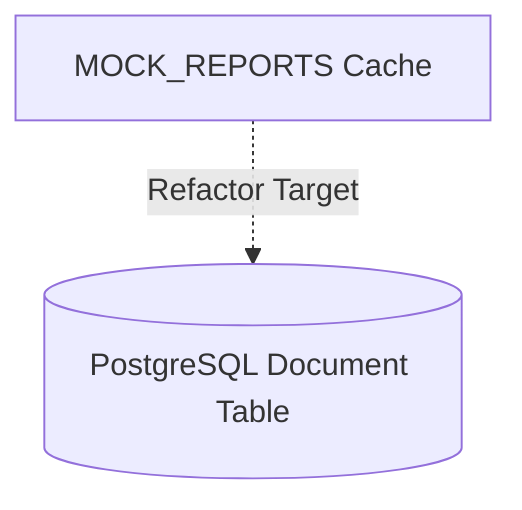

# Relational Status Persistence Architecture

This document tracks progress refactoring volatile memory caches to PostgreSQL-based relational status logs.

---

## 1. System Components Mapped

- **Document**: Stores core document headers, titles, slugs, and R2 metadata.
- **DocumentVersion**: Logs snapshots of document bodies, revisions, and release flags.

---

## 2. Dynamic DB Mappings

---

## 3. Database Schema Specifications

The relational schema requires joining the Document and DocumentVersion tables:

| Field | Type | Description |
| :--- | :--- | :--- |
| **id** | UUID | Primary key for Document |
| **status** | VARCHAR | Volatile status tracking ('Published', 'Unpublished') |
| **created_at** | TIMESTAMP | Creation date mapping |
