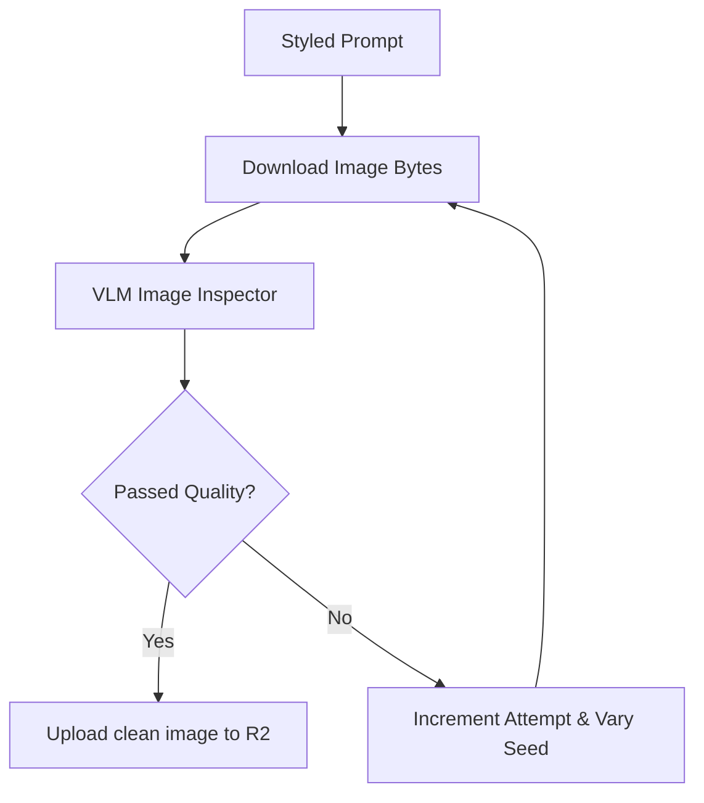

# VLM Quality Assessment Integration Report

This document outlines the Vision Language Model (VLM) assessor integration designed to inspect regenerated images for visual artifacts and automate seed-varying retries.

---

## 1. Quality Assessment Workflow

---

## 2. Assessor Parameters

- **VLM_ASSESSMENT_ENABLED**: Default `True` configuration flag.
- **VLM_ARTIFACT_THRESHOLD**: Confidence score benchmark set to `0.35` minimum.
- **VLM_MAX_RETRIES**: Attempt boundary limit set to `3` before exit.
