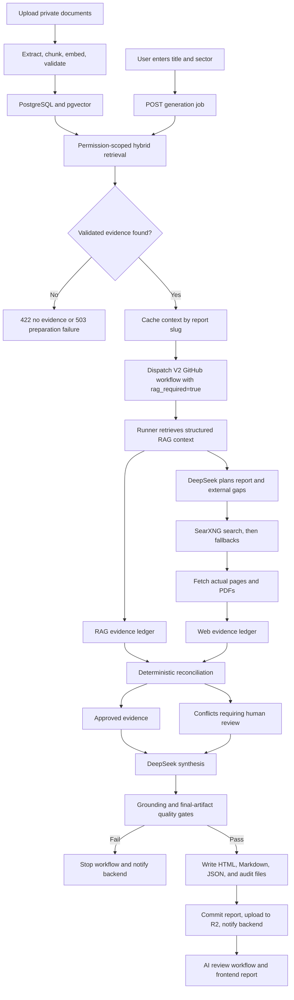

# Combined RAG, Web Search, and Human Review

**Purpose:** Authoritative implementation, configuration, operations, and validation reference

**Updated:** July 20, 2026

**Code baseline:** `main` at `a0a26e0`

**Current status:** Implemented on `main`; 39 generator/RAG tests pass. A live production run using the configured SearXNG instance is still required before production verification can be claimed.

## 1. System contract

The system follows these rules whenever RAG is enabled:

1. Uploaded and validated private documents are the primary source of truth.
2. Web search is supplementary. It fills external-data gaps, adds current context, and can corroborate private evidence.
3. Web evidence cannot silently replace private evidence.
4. Private and web evidence remain separately identifiable throughout generation, storage, and frontend delivery.
5. Comparable conflicting values are quarantined and shown in **Conflicts requiring human review**.
6. The software does not decide a conflict automatically. Until a human decision is recorded, the RAG value remains the working basis.
7. Unsupported claims, numbers, citations, and exhibits cause removal, retry, or workflow failure; they are not published to make the workflow pass.

## 2. What is implemented now

| Capability | State | Current behavior |
|---|---|---|
| Document upload and processing | Implemented | Documents are extracted, chunked, embedded, validated, and stored for retrieval. |
| Private-document retrieval | Implemented | Hybrid semantic/keyword retrieval returns permission-scoped, validated chunks. |
| RAG context handoff | Implemented | The backend caches a structured context package and the GitHub runner retrieves it by report slug. |
| RAG-first report generation | Implemented | DeepSeek receives private context as the primary grounding block. |
| Supplementary web search | Implemented | DeepSeek plans external-gap queries; SearXNG is the preferred search provider. |
| Free search-provider path | Implemented | Brave and `BRAVE_SEARCH_API_KEY` are removed. SearXNG requires a URL, not a Brave key. |
| Search fallbacks | Implemented | DuckDuckGo HTML, Bing HTML, GDELT, and known direct authoritative sources remain available. |
| Separate evidence ledgers | Implemented | RAG and web evidence receive separate IDs, origins, files, counts, and statuses. |
| Conflict detection | Implemented with a conservative scope | Structured numeric claims are compared only when metric, unit, period, and claim meaning align sufficiently. |
| Human-review presentation | Implemented | Conflicts are included in the report payload and rendered report section. |
| Numeric and exhibit grounding | Implemented | Unsupported narrative numbers and exhibits are pruned or rejected. Synthetic RAG chart fallbacks are disabled. |
| Frontend evidence handoff | Implemented in backend payload | `references`, `evidenceAudit`, and `conflicts` are preserved in `reportContent`. The frontend must render those fields to expose the full audit UI. |
| OpenSearch | Not used | PostgreSQL/pgvector already performs private-document indexing. OpenSearch is not a live-web crawler and is not required for this workflow. |
| Live SearXNG production verification | Pending | Configure `SEARXNG_URL`, run one mixed-source report, and inspect its audit artifacts. |

## 3. End-to-end workflow



### 3.1 Document ingestion

The knowledge subsystem:

- accepts the uploaded document into an authorized knowledge collection;
- extracts its text;
- uses a default chunk size of 1,000 characters and overlap of 200 characters;
- generates 384-dimensional embeddings using `BAAI/bge-small-en-v1.5` by default;
- stores vectors in PostgreSQL through pgvector;
- tracks processing and validation state;
- excludes deleted, incomplete, or unvalidated documents from generation retrieval.

Feature flags controlling this path are `KNOWLEDGE_ENABLED`, `UPLOAD_ENABLED`, `PROCESSING_ENABLED`, `RETRIEVAL_ENABLED`, `VALIDATION_ENABLED`, `SEARCH_ENABLED`, and `RAG_ENABLED`.

### 3.2 Generation request and context preparation

The frontend currently asks for a report title/topic and sector. The backend creates a document/report slug and receives the request at:

```text
POST /api/v1/generation/jobs
```

When RAG is enabled, the backend resolves requested collection IDs. If none are supplied, it uses active collections owned by the current user. It then:

1. checks collection permissions before cache access;
2. retrieves only completed and validated documents;
3. creates a query embedding;
4. runs pgvector cosine search and keyword scoring;
5. ranks results using 70% normalized semantic similarity and 30% keyword score;
6. falls back to deterministic lexical ranking if the embedding provider fails or semantic search produces no usable matches;
7. keeps the top 10 ranked chunks by default;
8. validates the retrieval session;
9. compiles whole chunks under the 6,000-token RAG budget;
10. skips a chunk that does not fit instead of cutting it mid-chunk;
11. creates a knowledge snapshot and caches the final package by report slug.

Relevant defaults:

| Setting | Default | Meaning |
|---|---:|---|
| `RAG_CONTEXT_TOKEN_BUDGET` | `6000` | Maximum estimated tokens in validated private context. |
| `RAG_CONTEXT_CACHE_TTL_SECONDS` | `14400` | Slug-context cache lifetime: four hours. |
| `RAG_MIN_RELEVANCE_SCORE` | `0.35` | Minimum hybrid relevance when semantic search is available. |
| Retrieval cache TTL | `300` seconds | Cache for an identical permission-scoped retrieval signature. |
| Retrieval target | `10` chunks | Final ranked retrieval limit used by context preparation. |

Failure behavior:

- no relevant validated chunks: HTTP `422`; no workflow is dispatched;
- retrieval, embedding, validation, database, or context-preparation exception: HTTP `503`; no workflow is dispatched;
- missing permissions or eligible collections: no validated evidence, so the request does not proceed as a grounded report.

### 3.3 GitHub Actions dispatch

The backend dispatches `.github/workflows/generate_deep_research_v2.yml` on `main` with `topic`, `slug`, model, and `rag_required=true`. The workflow has a 45-minute timeout and does not cancel an already-running report when another run starts.

The runner requires:

- `DEEPSEEK_API_KEY` for planning and synthesis;
- `BACKEND_URL` and `INTERNAL_TOKEN` to retrieve cached private context and post completion/failure events;
- `SEARXNG_URL` as a repository variable or secret for preferred web search;
- R2 credentials when report artifact upload is required.

### 3.4 RAG bridge

Before planning, the runner requests:

```text
GET {BACKEND_URL}/api/internal/context/{slug}
Authorization: Bearer {INTERNAL_TOKEN}
```

The package contains validated chunks, document references, validation metadata, snapshot metadata, and a preformatted context string. The runner rebuilds structured source records so every private excerpt retains its document ID, full chunk ID, file name, confidence, validation status, and private `internal://` URL.

If `RAG_REQUIRED=true`, missing credentials, an unavailable bridge, an invalid response, empty chunks, or unusable structured sources stops generation. The runner does not silently switch to a public-only report.

### 3.5 DeepSeek planning

DeepSeek performs reasoning and writing; it is not treated as a web source. In RAG mode it receives private context and must build the plan from document facts, generate external-gap queries, avoid searching again for known private facts, and avoid inventing unsupported values.

Private context is sent to the configured DeepSeek API for planning and synthesis. Search providers receive generated query strings, not the complete private chunk package. Because queries are derived from private context, confidential deployments must review whether generated query terms are acceptable to send to a web-search service.

### 3.6 Web discovery and page retrieval

Search order:

1. SearXNG, when `SEARXNG_URL` is configured;
2. DuckDuckGo HTML search;
3. Bing HTML search;
4. topic-specific direct authoritative candidates;
5. GDELT timelines and article search for the configured number of queries.

SearXNG is called through:

```text
GET {SEARXNG_URL}/search?q={query}&format=json&safesearch=1
```

`SEARXNG_URL` may be the instance base URL or end in `/search`. The instance must enable JSON output; otherwise it can return HTTP `403`.

The pipeline retrieves result URLs, follows redirects, extracts HTML or PDF content, removes scripts and layout noise, limits download size, and records final URL and provider. It never treats DeepSeek prose as web evidence. If a page cannot be extracted, a sufficiently substantive search snippet may be retained as snippet evidence.

RAG-mode search is bounded:

| Variable | Workflow value | Bound |
|---|---:|---|
| `GEN_RPT_RAG_WEB_MAX_QUERIES` | `4` | At most four planner gap queries. |
| `GEN_RPT_RAG_WEB_PER_QUERY` | `2` | At most two search results requested per query. |
| `GEN_RPT_RAG_WEB_MAX_SOURCES` | `8` | At most eight accepted public sources. |
| `GEN_RPT_RAG_WEB_REQUIRED` | `true` | No silent pure-RAG degradation when web supplementation has no usable structured evidence. |
| `GEN_RPT_GDELT_QUERIES` | `2` | GDELT enrichment is limited to the first two queries. |
| `GEN_RPT_FETCH_TIMEOUT` | `18` seconds | V2 page-fetch timeout. |

The larger public-only defaults do not override these tighter RAG bounds.

### 3.7 Evidence ledgers

Private and web evidence are extracted independently:

- RAG IDs: `RAG-E1`, `RAG-E2`, ...;
- web IDs: `WEB-E1`, `WEB-E2`, ...;
- up to 24 structured points are retained for each origin before reconciliation.

An evidence record can include:

| Field | Purpose |
|---|---|
| `id` | Evidence identifier used by exhibits and conflicts. |
| `origin` | `rag`, `web`, or `derived`. |
| `fact` | Source-backed statement. |
| `value`, `unit`, `display_value`, `year` | Parsed quantitative data. |
| `metric_family` | Deterministic category for comparisons. |
| `source_title`, `source_url`, `domain`, `source_type` | Provenance. |
| `authoritative`, `score` | Source-ranking metadata. |
| `status` | `primary`, `supplementary`, `corroborates_rag`, or `requires_human_review`. |

### 3.8 Reconciliation and conflicts

RAG evidence starts as `primary`; web evidence starts as `supplementary`. A web value is compared with RAG only when both are numeric, units match, metric families match and are meaningful, each sentence contains one value in that unit, years align, and meaningful claim-term overlap reaches the threshold.

| Condition | Result |
|---|---|
| Same comparable value | Web becomes `corroborates_rag`; both sources remain traceable. |
| Different comparable value | Both become `requires_human_review`; a conflict is created; the web value is excluded from approved evidence. |
| No reliable comparison | Web remains `supplementary`; the software does not guess. |

Each conflict stores its ID, reason, working basis, values, facts, source titles, URLs, and origins. `working_basis` remains `rag`.

The detector intentionally covers conservative structured numeric conflicts. It does not claim complete semantic conflict detection for qualitative statements, different geographies, changing definitions, or ambiguous periods.

### 3.9 Synthesis and quality gates

DeepSeek receives separate blocks for primary private context, approved supplementary/corroborating evidence, and the conflict register. Raw conflicting web values are not supplied as approved context.

RAG generation fails closed through these checks:

1. validated private sources must survive source merging;
2. required web supplementation must produce usable sources and structured web evidence;
3. unsupported model exhibits are removed before validation;
4. unsupported reader-visible numeric sentences are pruned;
5. synthesis gets one corrective retry for RAG quality issues;
6. sections need substantive analysis and traceable chunk citations;
7. visible numbers must exist in approved grounding;
8. exhibits must use approved evidence IDs or valid private chunks;
9. exhibits cannot use quarantined conflict evidence;
10. strict RAG normalization cannot inject synthetic actions, values, or charts;
11. the legacy `A/B/C = 60/45/30` placeholder chart is rejected;
12. conflicts require a rendered human-review section;
13. final normalized JSON and rendered HTML are validated.

A remaining required-gate error stops the workflow and triggers the backend failure event.

### 3.10 Output, storage, and frontend handoff

| Artifact | Contents |
|---|---|
| `index.html` | Final interactive report. |
| `report.md` | Final Markdown report. |
| `web_report_payload.json` | Normalized report, references, evidence audit, and conflicts. |
| `research_plan.json` | DeepSeek research plan. |
| `chart_data_needs.json` | Planned chart-data requirements. |
| `analysis_framework.json` | Internal analysis structure. |
| `publication_contract.json` | Publication rules and metadata. |
| `research_fact_pack.json` | Extracted facts and validation summary. |
| `sources.json` | Private and public source records. |
| `evidence_ledger.json` | Combined evidence before approval filtering. |
| `rag_evidence_ledger.json` | Private-document evidence. |
| `web_evidence_ledger.json` | Web evidence. |
| `approved_evidence.json` | RAG plus non-conflicting web evidence. |
| `evidence_conflicts.json` | Quarantined conflicts. |
| `rag_manifest.json` | Source/evidence counts, chunk/document IDs, queries, providers, conflicts, and search status. |

R2 stores report files under `reports/{report_id}/current/` and audit JSON under `reports/{report_id}/metadata/`. The backend preserves:

```text
reportContent.references
reportContent.evidenceAudit
reportContent.conflicts
```

`evidenceAudit` contains the manifest, reconciliation status, corroboration count, combined and separate ledgers, approved evidence, and conflicts. A frontend that renders only sections and images will hide this information even when the backend delivered it.

After successful generation, V2 commits `reports_web` output, uploads R2 artifacts when configured, sends `report-generated`, and triggers `generate_review_v2.yml`. On failure it sends `report-failed`.

## 4. Configuration checklist

### 4.1 Render backend

```text
RAG_ENABLED=true
KNOWLEDGE_ENABLED=true
UPLOAD_ENABLED=true
PROCESSING_ENABLED=true
RETRIEVAL_ENABLED=true
VALIDATION_ENABLED=true
SEARCH_ENABLED=true
DATABASE_URL=...
DEEPSEEK_API_KEY=...
INTERNAL_TOKEN=...
GITHUB_TOKEN=...
GITHUB_REPO=yt-feng/gen_rpt
BACKEND_URL=https://report-backend-api.onrender.com
CORS_ORIGINS=https://your-frontend.example
```

### 4.2 GitHub Actions secrets

```text
DEEPSEEK_API_KEY
BACKEND_URL
INTERNAL_TOKEN
R2_ACCOUNT_ID
R2_ACCESS_KEY_ID
R2_SECRET_ACCESS_KEY
R2_BUCKET
```

R2 values are workflow-optional, but normal R2/backend report loading requires a successful upload.

### 4.3 GitHub Actions variable or secret

```text
SEARXNG_URL=https://your-searxng-instance.example
```

Prefer a repository variable when the URL is not confidential. A secret with the same name is also accepted. Do not configure `BRAVE_SEARCH_API_KEY`; it is no longer read.

### 4.4 SearXNG instance requirements

The instance must be reachable from GitHub-hosted runners over HTTPS, enable JSON output, allow `/search`, have working upstream engines, use suitable rate limits/access controls, and return real result URLs. SearXNG software is open source, but compute, bandwidth, maintenance, and upstream reliability remain deployment responsibilities.

## 5. Human-review behavior

Automation identifies and presents conflicts but does not implement the human decision. A reviewer should inspect both excerpts and URLs, confirm comparability, select the accepted basis or request evidence correction, and regenerate after the evidence or approval state changes. Until then, RAG remains the working basis.

## 6. Failure and troubleshooting reference

| Symptom | Meaning | Action |
|---|---|---|
| API `422` | No relevant validated chunks. | Confirm processing, validation, collection status, permissions, and title relevance. |
| API `503` | Context preparation failed. | Inspect Render retrieval, embedding, validation, database, and cache logs. |
| RAG bridge unavailable | Worker credentials, URL, slug cache, or backend reachability is wrong. | Verify `BACKEND_URL`, matching `INTERNAL_TOKEN`, cached slug, and endpoint access. |
| SearXNG `403` | JSON is disabled or policy rejects the request. | Enable JSON and check limiter/proxy rules. |
| Zero usable web sources | No provider returned fetchable evidence. | Check SearXNG health, engines, outbound network, queries, and fetch logs. |
| Zero structured web evidence | Pages lacked extractable evidence. | Improve queries/sources; do not weaken the gate merely to publish. |
| Numeric gate failure | A number is absent from approved grounding. | Correct evidence or remove the claim. |
| Combined-evidence gate failure | Exhibit uses unknown/quarantined evidence. | Correct `data_basis`; never approve conflict evidence automatically. |
| Conflict count is zero | No comparable disagreement was found. | First verify web evidence exists; zero is not automatically a failure. |
| Audit missing in UI | Frontend is not rendering delivered audit fields. | Update the frontend repository, not the evidence pipeline. |
| Browser CORS error | Backend does not allow the deployed frontend origin. | Correct `CORS_ORIGINS` and redeploy. |

## 7. Validation procedure

After a mixed-source run, verify:

1. `rag_manifest.status` is `active`;
2. validated chunk and document counts are greater than zero;
3. `web_search_status` is `success`;
4. `web_search_providers` includes `searxng` for the preferred path;
5. RAG and web evidence counts are greater than zero;
6. separate `RAG-E*` and `WEB-E*` records exist;
7. approved evidence excludes conflicting web IDs;
8. manifest conflict count matches `evidence_conflicts.json`;
9. every visible material number is supported;
10. every exhibit has valid provenance;
11. HTML shows human review when conflicts exist;
12. backend returns references, audit, and conflicts;
13. R2 contains the manifest-referenced audit artifacts;
14. AI review starts only after successful generation.

| Scenario | Expected result |
|---|---|
| RAG facts with web gaps | RAG drives the decision; web fills missing external context. |
| RAG/web agreement | Web is marked `corroborates_rag`. |
| Deliberate same-metric conflict | Both values reach human review; RAG stays the basis. |
| Unrelated values with the same unit | No false conflict. |
| Missing RAG evidence | Rejected before dispatch. |
| Missing web evidence in required combined mode | Workflow fails instead of publishing pure RAG. |
| Unsupported number or exhibit | Removed or rejected. |
| Public-only manual run | Available only when RAG is not required. |

## 8. Definition of production-verified

Do not claim production verification until:

- deployed backend code includes `a0a26e0` or later equivalent behavior;
- `SEARXNG_URL` is healthy with JSON enabled;
- V2 completes successfully;
- a report contains both RAG and web evidence;
- provenance survives R2 and backend/frontend handoff;
- a deliberate conflict is quarantined and displayed;
- final HTML has no unsupported numbers or placeholders;
- frontend reviewers can see audit and conflict data;
- a human reviewer accepts the output.

## 9. Protected boundaries

Do not:

- allow web evidence to override RAG automatically;
- treat DeepSeek memory or prose as web evidence;
- retain model claims without a retrievable source;
- weaken quality gates to make workflows pass;
- cut private chunks mid-evidence;
- reintroduce synthetic RAG values or charts;
- replace pgvector with OpenSearch merely to support SearXNG;
- add another evidence database without measured need;
- change authentication, CORS, R2 paths, workflow triggers, or frontend inputs during search-provider maintenance;
- infer that zero conflicts means failure;
- claim production readiness from unit tests alone.

## 10. Code ownership map

| Responsibility | Primary file |
|---|---|
| Generation API and context pre-warm | `report-management-backend/app/api/v1/endpoints/generation.py` |
| Retrieval, ranking, lexical fallback | `report-management-backend/app/services/retrieval_engine.py` |
| Whole-chunk token budget | `report-management-backend/app/services/retrieval_context.py` |
| Validation, snapshot, slug cache | `report-management-backend/app/services/rag_integration.py` |
| Internal context endpoint | `report-management-backend/app/api/v1/endpoints/internal.py` |
| Dispatch and frontend payload handoff | `report-management-backend/app/services/generation.py` |
| Runner RAG bridge | `gen_rpt/main_web.py` |
| SearXNG, fallbacks, fetching, manifest | `gen_rpt/web_fetch.py` |
| Evidence extraction and reconciliation | `gen_rpt/web_evidence.py` |
| Combined pipeline and artifacts | `gen_rpt/web_report_pipeline.py` |
| Grounding and final gates | `gen_rpt/web_publication_contract.py` |
| Human-review renderer | `gen_rpt/web_report_renderer.py` |
| R2 artifact mapping | `storage/upload_report.py` |
| V2 orchestration | `.github/workflows/generate_deep_research_v2.yml` |
| Generator/RAG tests | `tests/test_rag_bridge.py` |
| Backend handoff tests | `report-management-backend/tests/test_rag_validation_gate.py` |

## 11. External references

- [SearXNG repository](https://github.com/searxng/searxng)
- [SearXNG Search API](https://docs.searxng.org/dev/search_api.html)
- [SearXNG installation guide](https://docs.searxng.org/admin/installation.html)
- [OpenSearch documentation](https://docs.opensearch.org/latest/about/)
- [pgvector repository](https://github.com/pgvector/pgvector)
