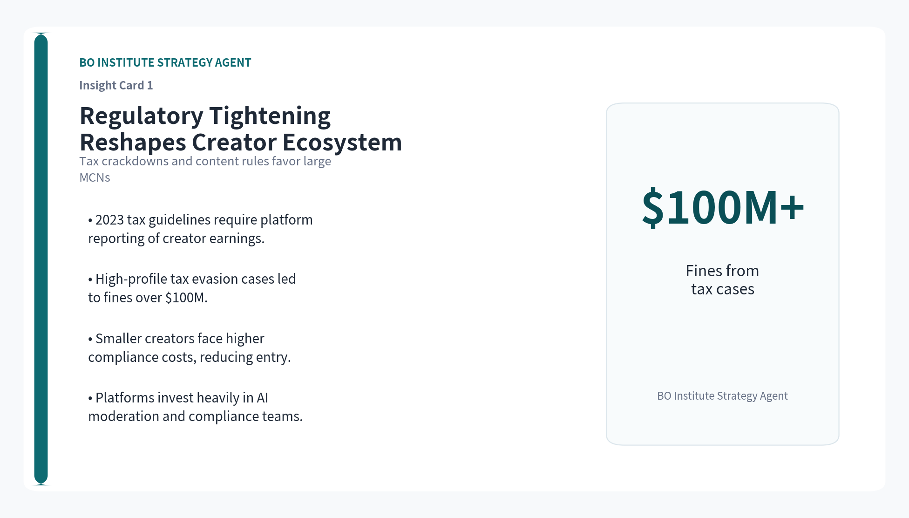
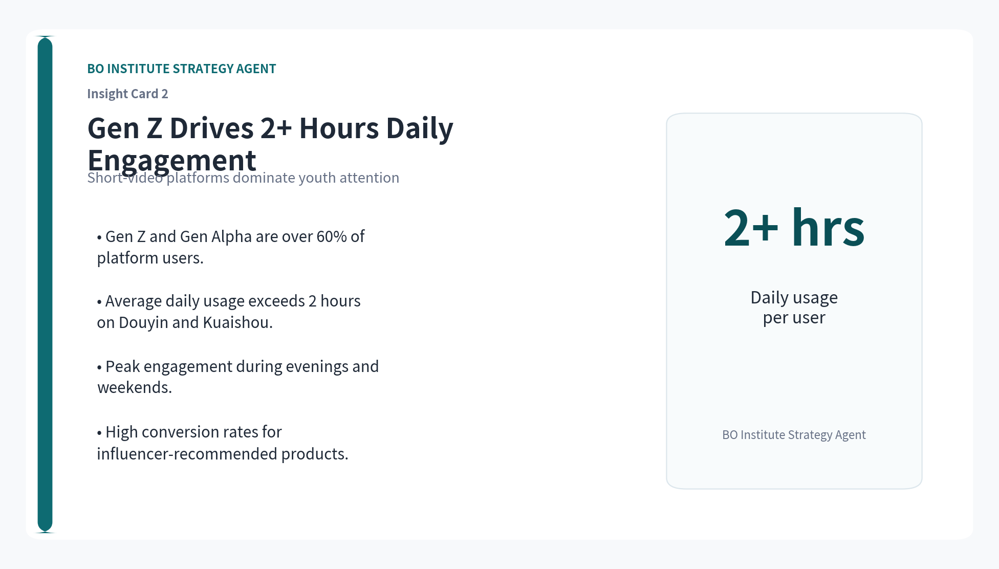
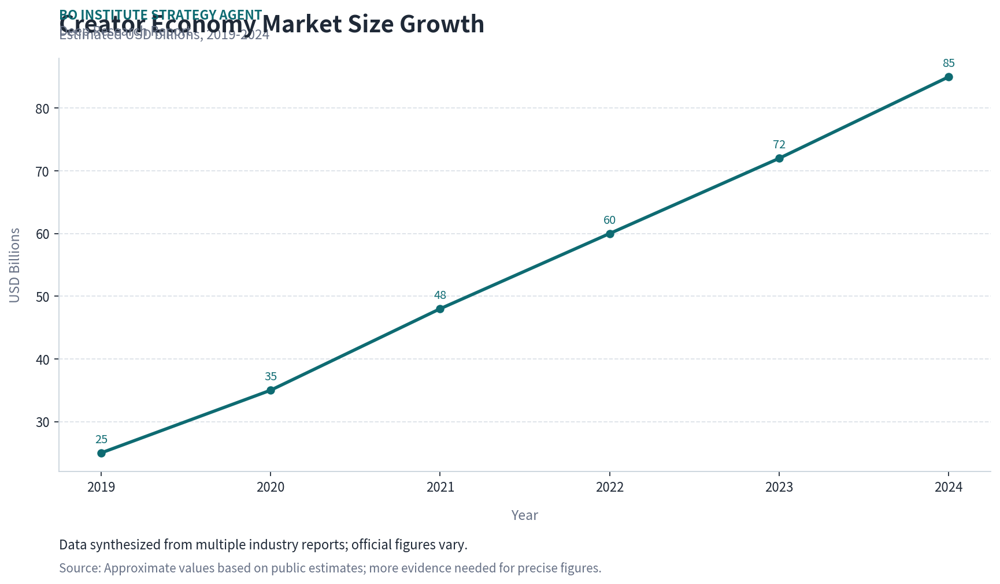
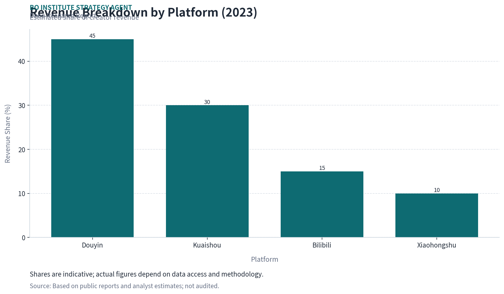
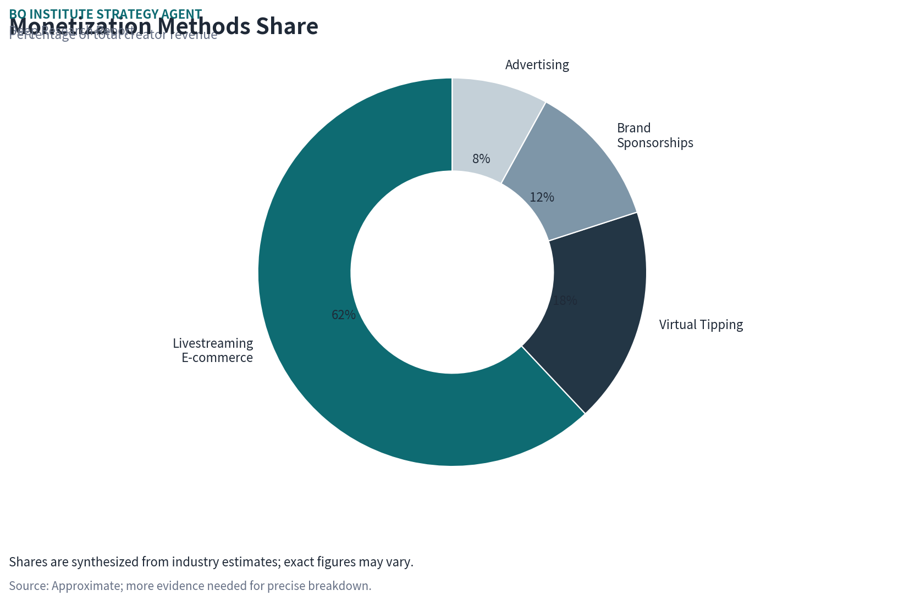
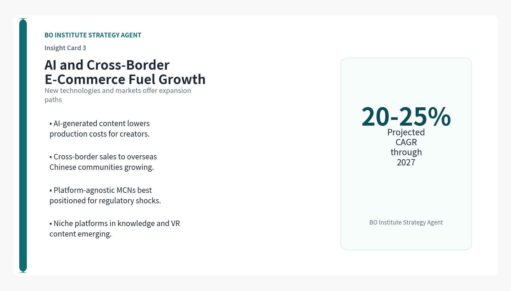

# China Creator Economy: Market Structure, Monetization, and Regulatory Dynamics

**Prepared by**: BO Institute Strategy Agent

> A Strategic Analysis for Global Investors and Platform Strategists

**Topic**: 中国创作者经济

## Executive Summary

- China's creator economy is projected to exceed $80 billion by 2024, driven by short-video platforms and livestreaming e-commerce.
- Livestreaming e-commerce accounts for over 60% of creator revenue, a model distinct from Western ad-based monetization.
- Regulatory tightening on content, tax compliance, and platform algorithms is reshaping creator-platform dynamics, favoring large MCNs.
- Gen Z and Gen Alpha dominate consumption, with average daily usage exceeding 2 hours on platforms like Douyin and Kuaishou.
- Investment opportunities exist in platform-agnostic MCNs, AI-driven content tools, and cross-border creator services, but regulatory risks remain high.

## Key Insight Cards

## Market Overview and Growth Drivers

> China's creator economy has evolved from a niche ecosystem into a multi-billion-dollar industry, propelled by mobile-first platforms, widespread 5G adoption, and a culture of digital gifting.

The Chinese creator economy is estimated to be worth over $80 billion in 2024, growing at a compound annual rate of approximately 25% since 2019. This growth is fueled by the rapid expansion of short-video platforms and livestreaming e-commerce, which have become the primary channels for content distribution and monetization. Unlike Western markets where advertising dominates, Chinese creators rely heavily on direct audience payments, including virtual tipping and e-commerce commissions.

Key structural drivers include the near-universal penetration of smartphones (over 1.1 billion users) and the integration of payment systems like Alipay and WeChat Pay, which enable frictionless microtransactions. Additionally, the Chinese government's push for digital infrastructure, such as 5G networks in rural areas, has expanded the creator base beyond tier-1 cities. However, official market size figures vary due to opaque reporting by private platforms, and the data should be treated as indicative.

The COVID-19 pandemic acted as a catalyst, accelerating the shift from offline retail to livestreaming e-commerce. By 2023, livestreaming e-commerce gross merchandise value (GMV) exceeded $500 billion, with creators capturing a significant share through commission fees. This model has created a virtuous cycle: more creators attract more viewers, which in turn attracts brands and platforms, further fueling growth.

Despite the impressive scale, the market faces headwinds including regulatory scrutiny on content quality, tax compliance for high-earning creators, and platform algorithm changes that can abruptly reduce creator visibility. These factors introduce volatility that investors must monitor closely.

**Section Takeaways**

- Market size estimated at $80B+ in 2024, growing ~25% CAGR.
- Livestreaming e-commerce GMV exceeded $500B in 2023.
- Regulatory and data opacity are key risks to growth projections.

## Key Platforms and Competitive Landscape

> The Chinese creator economy is dominated by a handful of super-apps, each with distinct user demographics and monetization mechanisms.

Douyin (TikTok's Chinese counterpart) leads the market with over 700 million daily active users (DAU) and a revenue model heavily weighted toward livestreaming e-commerce and in-app tipping. Kuaishou, the second-largest short-video platform, has approximately 400 million DAU and a stronger presence in lower-tier cities, with a focus on social commerce and community-driven content. Bilibili, targeting Gen Z and millennial audiences, relies on subscription-based memberships, advertising, and game-related content, with a smaller but highly engaged user base of around 100 million DAU.

Xiaohongshu (Little Red Book) occupies a niche in lifestyle and beauty content, blending social commerce with user-generated reviews. Its monetization is primarily through brand sponsorships and e-commerce links, appealing to female users aged 18-35. WeChat Channels, integrated into the WeChat ecosystem, leverages its massive user base (over 1.2 billion monthly active users) for short-video and livestreaming, though its creator monetization is still developing compared to dedicated platforms.

Competition among platforms is intense, with each vying for creator exclusivity and user attention. Douyin and Kuaishou have invested heavily in creator funds and training programs, while Bilibili differentiates through longer-form, high-quality content. The competitive landscape is further complicated by the rise of vertical platforms like Zhihu (knowledge sharing) and Taobao Live (e-commerce focused), which cater to specific creator niches.

For investors, the platform landscape offers both opportunities and risks. Douyin's dominance provides a stable ecosystem but also high entry barriers for new creators. Kuaishou's lower-tier user base presents growth potential, while Bilibili's loyal community offers brand safety. However, platform-specific data on creator earnings and user engagement is often self-reported and should be cross-verified with third-party sources.

**Section Takeaways**

- Douyin leads with 700M+ DAU; Kuaishou has 400M DAU.
- Bilibili and Xiaohongshu serve niche, high-engagement audiences.
- Platform competition drives creator fund investments but data opacity persists.

## Creator Monetization Models and Revenue Streams

> Chinese creators employ a diversified set of monetization methods, with livestreaming e-commerce and virtual tipping far surpassing advertising in revenue share.

The primary revenue streams for Chinese creators include livestreaming e-commerce commissions, virtual tipping (virtual gifts), brand sponsorships, advertising revenue sharing, and subscription-based memberships. According to industry estimates, livestreaming e-commerce accounts for approximately 60-65% of total creator revenue, followed by tipping at 15-20%, brand sponsorships at 10-15%, and advertising at 5-10%. This structure contrasts sharply with Western markets, where advertising typically contributes over 70% of creator income.

Livestreaming e-commerce allows creators to sell products in real-time, earning commissions ranging from 10% to 30% of GMV. Top creators like Li Jiaqi (Austin Li) and Viya have generated billions in sales, though regulatory scrutiny on tax compliance and product quality has increased. Virtual tipping, where viewers purchase digital gifts using platform currency, is particularly prevalent on Douyin and Kuaishou, with creators receiving a 50% cut after platform fees.

Brand sponsorships remain a significant income source, especially for mid-tier creators on platforms like Xiaohongshu and Bilibili. These deals are often facilitated by Multi-Channel Networks (MCNs), which manage creator-brand relationships and take a commission of 20-50%. Advertising revenue sharing, while less dominant, is growing on platforms like Bilibili, which offers a 'creative incentive' program based on view counts and engagement.

The monetization landscape is evolving with the introduction of subscription models (e.g., Bilibili's 'Bilibili Membership') and virtual item sales in gaming-related content. However, creators face challenges such as platform commission fees (often 50% or more on tips), algorithm changes that reduce organic reach, and regulatory caps on livestreaming hours for certain categories. These factors make revenue diversification critical for long-term sustainability.

**Section Takeaways**

- Livestreaming e-commerce drives 60-65% of creator revenue.
- Virtual tipping accounts for 15-20%, brand sponsorships 10-15%.
- Platform fees and regulatory caps pose risks to creator income.

## Regulatory Environment and Policy Impacts

> China's regulatory framework for the creator economy has tightened significantly since 2021, affecting content standards, tax compliance, and platform operations.

The Chinese government has implemented a series of regulations aimed at curbing excessive commercialization, protecting minors, and ensuring tax compliance among high-earning creators. Key policies include the 2021 'Livestreaming Marketing Management Measures,' which require platforms to verify creator identities, cap tipping amounts for minors, and ban content that promotes vulgarity or false advertising. In 2023, new tax guidelines mandated that platforms report creator earnings exceeding a certain threshold to tax authorities, leading to high-profile tax evasion cases and fines.

These regulations have reshaped the creator-platform relationship. Platforms are now legally liable for content violations, prompting them to invest in AI-based content moderation and compliance teams. MCNs have consolidated to meet regulatory requirements, with larger agencies better equipped to handle tax filings and content audits. Smaller creators and independent MCNs face higher compliance costs, potentially reducing market entry.

The regulatory environment also impacts monetization. For example, restrictions on livestreaming hours for certain product categories (e.g., healthcare, financial products) have reduced revenue opportunities. Additionally, the government's push for 'common prosperity' has led to calls for platforms to reduce income inequality among creators, though concrete policies remain vague. Investors should monitor upcoming regulations on algorithmic transparency and data privacy, which could affect platform operations.

Despite the tightening, the government continues to support the creator economy as a driver of digital consumption and employment. Policies such as tax incentives for rural creators and subsidies for digital content innovation indicate a balanced approach. However, sudden policy shifts remain a key risk, as seen in the 2021 crackdown on the gaming and education sectors.

**Section Takeaways**

- Regulations since 2021 focus on content, tax, and minor protection.
- Larger MCNs benefit from compliance costs; smaller creators face barriers.
- Policy volatility is a key risk; government support for digital economy persists.

## Audience Behavior and Demographic Trends

> China's creator economy is driven by young, mobile-first users who spend significant time on short-video platforms and are highly receptive to influencer-driven commerce.

Gen Z (born 1997-2012) and Gen Alpha (born after 2012) constitute the core audience for creator content, accounting for over 60% of users on Douyin and Kuaishou. Average daily usage on these platforms exceeds 2 hours, with peak engagement during evening hours and weekends. This demographic is characterized by high digital literacy, a preference for authentic and relatable content, and a strong propensity to purchase products recommended by creators.

Geographically, user penetration is highest in tier-1 and tier-2 cities, but growth is accelerating in lower-tier cities and rural areas due to improved internet infrastructure. Platforms like Kuaishou have successfully tapped into these markets by featuring local creators and community-focused content. Gender distribution varies by platform: Douyin has a relatively balanced split, while Xiaohongshu skews heavily female (over 70%).

Content preferences are shifting from purely entertainment to educational and lifestyle content. Categories such as beauty, fashion, food, and technology dominate, but niche areas like finance, health, and virtual reality are gaining traction. The rise of 'knowledge creators' on platforms like Bilibili and Zhihu reflects a demand for deeper, value-driven content, which commands higher engagement and brand sponsorship rates.

For investors, understanding audience behavior is crucial for platform selection and content strategy. The high engagement levels and e-commerce conversion rates in China offer a compelling value proposition, but demographic shifts (e.g., aging population) and content saturation pose long-term risks. Platforms that can maintain user trust and adapt to changing preferences will likely outperform.

**Section Takeaways**

- Gen Z and Gen Alpha are 60%+ of users; daily usage >2 hours.
- Growth in lower-tier cities and rural areas is accelerating.
- Content shifts from entertainment to education and lifestyle.

## Future Outlook and Investment Opportunities

> The Chinese creator economy is poised for continued growth, but success will depend on navigating regulatory complexities and platform dynamics.

Looking ahead, the creator economy is expected to grow at a CAGR of 20-25% through 2027, driven by further integration of AI tools for content creation, expansion of cross-border e-commerce, and the maturation of subscription models. AI-generated content (AIGC) is emerging as a double-edged sword: it can lower production costs for creators but also increase competition and regulatory scrutiny on authenticity. Platforms like Douyin are already testing AI-powered virtual influencers, which could reshape the creator landscape.

Investment opportunities are most promising in platform-agnostic MCNs that can diversify across multiple platforms and revenue streams. These agencies are better positioned to absorb regulatory shocks and negotiate favorable terms with platforms. Additionally, technology providers offering creator analytics, AI editing tools, and compliance automation are likely to see strong demand as the ecosystem professionalizes.

Cross-border e-commerce presents a significant growth avenue, as Chinese creators leverage platforms like Douyin and Kuaishou to sell products to overseas Chinese communities and international consumers. However, this requires navigating export regulations, logistics, and cultural differences. Investors should also consider the potential of niche platforms serving specific creator segments, such as knowledge sharing or virtual reality content.

Risks remain substantial, including regulatory volatility, platform dependency, and data reliability issues. Investors should conduct thorough due diligence, focusing on platforms with transparent reporting and diversified revenue models. The long-term winners will be those that can balance innovation with compliance, and scale while maintaining creator and user trust.

**Section Takeaways**

- Market expected to grow 20-25% CAGR through 2027.
- Opportunities in MCNs, AI tools, and cross-border e-commerce.
- Regulatory and platform risks require careful due diligence.

## Charts

## References

1. [China Internet Network Information Center (CNNIC) Reports](https://www.cnnic.com.cn)
   - Official user statistics and internet development reports.
1. [QuestMobile Research on Short-Video Platforms](https://www.questmobile.com.cn)
   - Third-party data on user demographics and engagement.
1. [China's Livestreaming E-commerce Regulations (2021)](https://www.gov.cn)
   - Official policy document on livestreaming marketing management.
1. [iResearch China Creator Economy Report](https://www.iresearch.com.cn)
   - Industry analysis and market size estimates.
